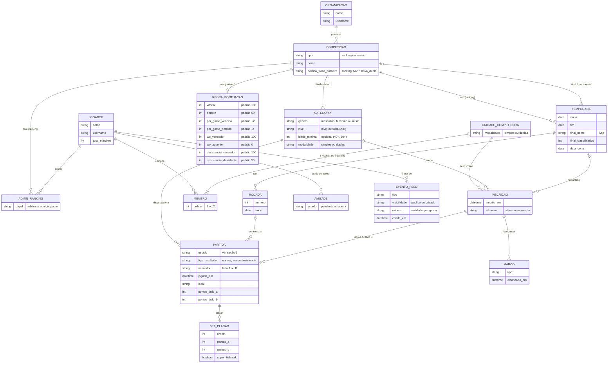
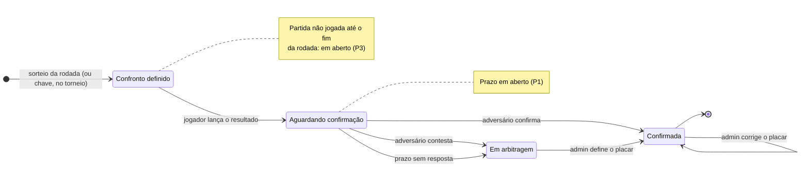

# DOMAIN.md — LetzPlay

Modelo de domínio do LetzPlay: as entidades do Beach Tennis competitivo, como se relacionam e as regras que valem entre elas. É a fonte para os tipos, os mocks e, quando a feature pedir, as tabelas.

> Este doc registra **o que foi decidido**. Cada regra cita a origem (seção "Fontes"). O que ainda está aberto fica em "Perguntas e riscos", com recomendação, e só vira regra depois da decisão do Gabriel. Nomes de tabela, colunas e tipos TS são decisão de implementação e não moram aqui.

Para visão e escopo do MVP, ver `docs/PRODUCT.md`. Para a especificação visual dos cards do feed, ver `docs/FEED_CARDS.md`. Para as evidências de mercado, ver `docs/DISCOVERY.md` e `docs/discovery/`.

---

## Fontes

As decisões foram tomadas pelo Gabriel em 26/09/2026 e estão registradas como comentários no Linear. Aqui elas aparecem pela sigla.

| Sigla | Origem | Conteúdo |
| --- | --- | --- |
| **DEC-DOM** | Issue da spec de domínio, comentário "Decisões de domínio do Gabriel" | Unidade competidora, categoria, pontuação por partida, ciclo do resultado, admin, H2H, `total_matches` |
| **DEC-PESQ** | Issue da spec de domínio, comentário "Complemento, com a pesquisa das regras do Rankin e do Vila do Tênis" | Estrutura temporada → rodada → sorteio, tabela de pontos padrão, W.O., desistência, classificação só por dupla. **Substitui a DEC-DOM onde as duas divergem** (W.O.) |
| **DEC-FINAL** | Issue da spec de domínio, comentário "Final da temporada, decidido" | Final como torneio comum, conquistas permanentes no feed, linha de corte na tela de ranking |
| **DEC-CARDS** | Issue do diagnóstico dos cards do feed, respostas às perguntas D1–D7 | H2H no card e na página, confronto definido no ranking, nome da categoria, textos neutros |
| **DEC-FEED** | Issue da spec do feed com dados reais, comentário "Princípio do feed" | Feed público mostra conquistas e crescimento; evento com visibilidade |
| **PESQ-RV** | Regras públicas do Rankin e do Vila do Tênis (BH), que usam o LetzPlay legado com a mesma configuração: `letzplay.me/rankin/rankings/55513/about`, `letzplay.me/vila-tenis-bt/rankings/56068/about`, `viladotenis.com/area-do-atleta` | Referências reais de jogos por rodada, prazo para combinar a data, regra de desistência |
| **DSC** | `docs/DISCOVERY.md` e `docs/discovery/` | Evidência de mercado citada nas perguntas |

---

## 1. Glossário

As entidades estão agrupadas pelo papel que cumprem. Os nomes em **negrito** são os termos canônicos: use-os nos textos da interface, nas issues e nos PRs.

### Pessoas e relações

| Termo | Definição | Regras |
| --- | --- | --- |
| **Jogador** | Pessoa com conta no LetzPlay. Tem nome, @username, foto e o contador `total_matches`. O cadastro não coleta gênero | R18, R19, R26 |
| **Amizade** | Conexão bilateral entre dois jogadores: um pede, o outro aceita. Só a amizade aceita gera evento no feed | R24 |
| **Admin do ranking** | Jogador com permissão para arbitrar contestações e falta de resposta, e para corrigir placar, **num ranking específico**. É um papel mínimo, não a visão do organizador | R14, R15 |

### Competição

| Termo | Definição | Regras |
| --- | --- | --- |
| **Organização** | Arena, clube, federação ou grupo que promove competições. Aparece no cabeçalho dos cards de resultado, confronto e inscrição | — |
| **Competição** | Guarda-chuva de tudo que se disputa. Tem dois tipos, com peso igual no produto: **ranking** e **torneio** | R3, R6 |
| **Ranking** | Competição contínua, dividida em temporadas. Os confrontos saem de sorteios por rodada; o jogador não escolhe o adversário. Tem uma **regra de pontuação** e uma **política de troca de parceiro** próprias | R7, R8, R9, R17 |
| **Torneio** | Competição discreta, de 1 ou 2 dias, com chave. A final de uma temporada de ranking é um torneio comum | R27 |
| **Temporada** | Período de um ranking (em geral, um semestre). Guarda o **nome da final** (livre: "Saideira", "Finals"), a **quantidade de classificados** e a **data de corte**. Os pontos somam dentro da temporada | R8, R27, R28 |
| **Rodada** | Etapa da temporada. Cada rodada tem um sorteio, e cada unidade competidora joga nela o número de partidas definido pelo ranking (Rankin: 4; Vila: 2) | R7 |
| **Categoria** | Divisão de uma competição por **gênero + nível + idade** (ex.: "Masculino B", "Mista C 40+"), com a **modalidade** simples ou duplas. Uma competição tem várias categorias; a classificação é por categoria | R3, R4 |
| **Regra de pontuação** | Tabela de valores de um ranking: vitória, derrota, por game vencido, por game perdido, W.O. e desistência. Nasce com o padrão da R9 | R9–R11 |

### Quem compete

| Termo | Definição | Regras |
| --- | --- | --- |
| **Unidade competidora** | Quem ocupa um lado da partida e uma linha da classificação: uma **dupla** (duplas) ou um **jogador** (simples) | R1, R3 |
| **Dupla** | Dois jogadores que competem juntos. A identidade da dupla é o par de jogadores. Um jogador tem várias duplas, uma por ranking ou categoria; e a mesma dupla pode estar em vários rankings, com uma inscrição em cada | R2, R17 |
| **Inscrição** | A participação de uma unidade competidora numa categoria: de uma temporada, no ranking, ou do evento, no torneio. É na inscrição que os pontos se acumulam. Trocar de parceiro gera uma inscrição nova | R8, R17 |

### Jogo

| Termo | Definição | Regras |
| --- | --- | --- |
| **Sorteio** | Ato do organizador (ou do admin) que define os confrontos de uma rodada. No torneio, o equivalente é a chave. O sorteio não é guardado como entidade: ele **cria as partidas** | R7 |
| **Confronto** | Uma partida definida e ainda sem resultado. É o que o card "Confronto definido" mostra, no ranking e no torneio | R7 |
| **Partida** | Encontro entre duas unidades competidoras de uma mesma categoria. Nasce do sorteio ou da chave, é marcada fora do app e recebe o resultado no app. Segue a máquina de estados da seção 3 | R7, R12–R16 |
| **Tipo de resultado** | **Normal**, **W.O.** ou **desistência**. Cada tipo pontua de um jeito | R9–R12 |
| **Placar** | Sequência de sets, cada um com os games dos dois lados; o terceiro set pode ser um super tiebreak (STB). Na desistência, guarda o placar parcial, incluindo o set interrompido. No W.O. não há placar | R9, R11 |
| **Pontuação** | Pontos que cada lado ganha numa partida confirmada, calculados pela regra do ranking | R8–R11 |
| **Classificação** | Ordem das unidades competidoras de uma categoria numa temporada, pela soma dos pontos. Existe **só por unidade competidora**: não há tabela por jogador | R1, R8, R23 |

### Feed

| Termo | Definição | Regras |
| --- | --- | --- |
| **Evento do feed** | Registro automático de algo que aconteceu (resultado, confronto, inscrição, amizade, movimentação no ranking, marco, classificação para a final). Tem **ator**, **tipo**, **origem** (a entidade que o gerou) e **visibilidade**: público ou privado | R20–R24 |
| **Marco** | Conquista permanente de uma unidade competidora, registrada uma única vez (ex.: "Entrou no top 8 pela primeira vez"). Nunca é revogada por uma rodada seguinte | R25 |
| **H2H** | Histórico de confrontos entre dois lados, derivado das partidas confirmadas. No card, entre as duplas exatas; na página de H2H, jogador × jogador | R19 |

### Relações

**Como ler o diagrama:**

- **Unidade competidora + membro** resolve simples e duplas com a mesma estrutura: a unidade tem 1 membro em simples e 2 em duplas. Como a identidade da dupla é o par, "Lucas e Rafael" é a mesma unidade em qualquer competição. É isso que permite o H2H da dupla exata (R19).
- **Inscrição** é onde os pontos moram. A mesma dupla pode estar inscrita em dois rankings, com duas classificações independentes (R2).
- **Classificação** não aparece como entidade: é a soma de `pontos_lado_*` das partidas confirmadas de cada inscrição, ordenada. Se guardar fotos da classificação por rodada vai ser preciso depende da pergunta P8.
- **Sorteio e confronto** também não aparecem: o sorteio cria partidas, e o confronto é a partida no estado "Confronto definido".
- **Temporada → competição (final)** é opcional: a temporada pode apontar para o torneio que é a final dela.

---

## 2. Regras de domínio

Regras numeradas para serem citadas em issues, testes e PRs (ex.: "implementa R10"). Cada uma traz a origem entre colchetes.

### Unidade competidora e estrutura

- **R1. A classificação é por unidade competidora.** Em duplas, a posição é da dupla, nunca de cada jogador. O LetzPlay não tem tabela por jogador, mesmo que o organizador tenha uma fora do app (o Rankin tem). [DEC-DOM, DEC-PESQ, DEC-CARDS D2]
- **R2. Um jogador participa de vários rankings ao mesmo tempo**, com uma dupla por ranking ou categoria. [DEC-DOM]
- **R3. Simples e duplas existem no ranking e no torneio.** O modelo trata a unidade competidora como dupla ou jogador, e a modalidade é da categoria. [DEC-DOM]
- **R4. A categoria é gênero + nível + idade.** O nome segue esse padrão ("Masculino B", "Mista C 40+"), e a modalidade só aparece quando é simples. [DEC-DOM, DEC-CARDS D6]
- **R5. Pontos de federação ficam fora do produto.** Torneios que valem ponto para federação existem, mas o LetzPlay não guarda nem calcula esses pontos. [DEC-DOM]
- **R6. Ranking de arena e torneio têm peso igual** como tipos de competição. [DEC-DOM, que retoma a síntese do discovery]
- **R7. O ranking funciona em temporada → rodadas → sorteio → partidas.** O organizador lança o sorteio no app, o jogador não escolhe o adversário, a data é combinada fora do app e o resultado volta para o app. Por isso o card "Confronto definido" existe também no ranking: ele nasce do sorteio. O número de partidas por rodada e de rodadas por temporada varia por ranking (Rankin: 4 jogos por rodada; Vila: 2 jogos por rodada, 4 rodadas por semestre, 72h para combinar a data). [DEC-PESQ, DEC-CARDS D3, PESQ-RV]

### Pontuação

- **R8. O ranking soma pontos por partida.** A classificação de uma temporada é a soma dos pontos das partidas confirmadas de cada inscrição. [DEC-DOM]
- **R9. Resultado normal: vitória 100, derrota 50, +2 por game vencido, −2 por game perdido.** É o padrão, e todos os valores ficam guardados por ranking. [DEC-PESQ]

  Exemplo, 6/4 6/3: o vencedor fez 12 games e perdeu 7, e leva 100 + 24 − 14 = **110**. O perdedor fez 7 e perdeu 12, e leva 50 + 14 − 24 = **40**. Como o STB conta nessa soma está em aberto (P6).
- **R10. W.O.: quem compareceu leva 100, o ausente leva 0.** Substitui a versão anterior ("o ausente leva derrota"). [DEC-PESQ]
- **R11. Desistência ou lesão: o vencedor leva 100, o desistente leva 50.** O placar parcial conta, e quem lança o resultado é o adversário de quem desistiu. É a regra do Vila. Se os ±2 por game se aplicam ao placar parcial está em aberto (P6). [DEC-PESQ, PESQ-RV]
- **R12. Toda partida com resultado tem um tipo: normal, W.O. ou desistência.** O tipo define a pontuação (R9–R11), a contagem (R18) e o H2H (R19). [DEC-PESQ]

### Ciclo do resultado

- **R13. Um jogador lança o resultado e o adversário confirma ou contesta.** [DEC-DOM]
- **R14. Contestação e falta de resposta vão para o admin, que arbitra.** Quanto tempo o adversário tem para responder está em aberto (P1). [DEC-DOM]
- **R15. O admin do ranking é um jogador com permissão para arbitrar e corrigir placar**, inclusive depois da confirmação. É um papel por ranking, não a visão do organizador. [DEC-DOM]
- **R16. Só partida confirmada pontua, conta e vira evento de resultado.** O card de resultado nasce da confirmação, seja pelo adversário, seja pelo admin. [DEC-DOM; gatilho do card em `FEED_CARDS.md` §4]

### Troca de parceiro

- **R17. No MVP, trocar de parceiro cria uma dupla nova, que começa do zero.** Na vida real a regra varia por ranking. Por isso o ranking já nasce com um campo de **política de troca**, mas o único valor que funciona no MVP é "nova dupla". [DEC-DOM]

### Contagens e H2H

- **R18. `total_matches` conta toda partida confirmada do jogador**, em simples e duplas, torneio e ranking, **exceto W.O.** A desistência conta, porque houve jogo. [DEC-DOM, DEC-CARDS D4]
- **R19. H2H: no card, a dupla exata; na página de H2H, jogador × jogador.** O card responde "esses dois lados já se enfrentaram?"; a página serve para avaliar o adversário (JTBD 3). **W.O. não conta como confronto** nos dois casos. [DEC-DOM, DEC-CARDS D1]

### Feed

- **R20. O feed público mostra conquistas e crescimento.** [DEC-FEED]
- **R21. Todo evento do feed tem visibilidade: público ou privado.** [DEC-FEED]
- **R22. "Caiu no ranking" é privado:** só o próprio jogador vê, como informação, e não vira publicação para os amigos. Em duplas, os dois jogadores da dupla veem. [DEC-FEED; a extensão para a dupla é derivação da R1]
- **R23. A situação "dentro ou fora da final" aparece só na tela de ranking**, como uma linha de corte na tabela. Não existe badge de "zona", que poderia sumir na rodada seguinte. [DEC-FINAL]
- **R24. Eventos automáticos do feed:** resultado confirmado, confronto definido, inscrição, amizade aceita, movimentação no ranking (subiu é público, caiu é privado), marco e classificação para a final. Variação zero de posição não gera evento. [DEC-FEED, DEC-FINAL; `FEED_CARDS.md` §1 e §8.6]
- **R25. Marcos são eventos permanentes de primeira vez**, como "Entrou no top 8 pela primeira vez". Nada no feed pode ser desmentido na rodada seguinte. Quais marcos existem e em que escopo conta a "primeira vez" está em aberto (P9). [DEC-FINAL, DEC-FEED]
- **R26. Textos do feed são neutros em gênero** ("agora são amigos", "Liderança"), porque o cadastro não coleta gênero. [DEC-CARDS D7]

### Final da temporada

- **R27. A temporada guarda nome da final, quantidade de classificados e data de corte.** A final é um torneio comum. [DEC-FINAL]
- **R28. A vaga na final é por posição na data de corte**, nunca por garantia matemática. Depois do corte, cada classificado ganha o evento "Classificado para a [nome da final]". [DEC-FINAL; DSC, oportunidade 2.3]

---

## 3. Máquina de estados da partida

O diagrama cobre a partida de **ranking**, que é onde o ciclo foi decidido (R13–R16). A partida não realizada (P3) e o resultado de torneio (P2) dependem de perguntas abertas e ainda não entram.

| Estado | Pontua? | Conta em `total_matches` e H2H? | Evento no feed |
| --- | --- | --- | --- |
| Confronto definido | Não | Não | "Confronto definido" (público) |
| Aguardando confirmação | Não | Não | Nenhum. É pendência dos jogadores, não conquista |
| Em arbitragem | Não | Não | Nenhum |
| Confirmada | Sim (R9–R11) | Sim, exceto W.O. (R18, R19) | "Resultado" (público); pode gerar movimentação, marco e, depois do corte, classificação |

**Correção pelo admin depois da confirmação** recalcula os pontos da partida e, com eles, a classificação. O que acontece com os eventos já publicados é a pergunta P10.

---

## 4. Fora do MVP

| Item | Por quê | Origem |
| --- | --- | --- |
| **Pontos de federação** (CBT, CBBT, estaduais, dupla chancela) | O app não guarda nem calcula. Torneios que pontuam para federação continuam existindo como torneios comuns | DEC-DOM |
| **Fases da final e gestão de chaves** (ex.: classificatória top 16 → final top 8 da Saideira) | A final é um torneio comum; montar a chave é gestão de torneio | DEC-FINAL, `PRODUCT.md` |
| **Configurar a política de troca de parceiro** | O campo existe, mas só "nova dupla do zero" funciona. Configurar outras políticas vira issue futura | DEC-DOM |
| **Visão do organizador** além do papel de admin do ranking | O admin só arbitra e corrige placar. Criar competição, categoria e temporada pela interface fica fora. Quem lança o sorteio e as inscrições no MVP está em aberto (P13) | DEC-DOM, `PRODUCT.md` |
| **Classificação por jogador** | Só por unidade competidora (R1) | DEC-PESQ |
| **Subir de categoria** | Anotado para o futuro. Referência: no Vila, só sobe quem se classificou para o Finals | DEC-PESQ |
| **Seguir organização** | Decisão anterior, registrada em `FEED_CARDS.md` | `FEED_CARDS.md` |

---

## 5. Perguntas e riscos

Lacunas que apareceram ao modelar. Nenhuma está decidida: cada uma traz opções, trade-offs e uma recomendação, e vira regra só com a resposta do Gabriel.

### P1. Quanto tempo o adversário tem para responder ao resultado?

A R14 manda a falta de resposta para o admin, mas não diz depois de quanto tempo. **Risco:** a queixa pública mais documentada do LetzPlay legado é resultado pendente por meses porque o organizador não age (DSC, oportunidade 2.1). O legado evita isso com auto-aprovação em 24h. Com a R14, a fila do admin passa a ser o gargalo.

1. **24h fixo** — igual ao legado e ao Playtomic; o jogador já conhece. Não se adapta a ranking com admin menos presente.
2. **Configurável por ranking, padrão 24h** — acompanha a variação real entre organizadores. Um campo a mais na regra do ranking.
3. **48h fixo** — dá tempo ao adversário, mas atrasa todo resultado.

**Recomendação:** 2. Custa um campo, e o padrão de 24h é o que o jogador já espera. Para medir o risco, acompanhar no beta o percentual de partidas confirmadas em até 24h e em até 7 dias (a métrica R1 da árvore de oportunidades do discovery). Se a fila do admin travar, é a R14 que precisa ser revista, e isso é decisão sua.

### P2. Quem lança e quem confirma, em duplas e no torneio?

A R13 diz "um jogador lança, o adversário confirma", mas numa partida de duplas são quatro pessoas. E no torneio o card de resultado espera "registrado pela organização" (`FEED_CARDS.md` §4), enquanto a visão do organizador está fora do MVP.

**Ranking em duplas:**
1. Qualquer um dos 4 lança; qualquer um dos 2 do lado adversário confirma ou contesta, e vale a primeira resposta — rápido, mas um jogador responde pela dupla.
2. Os dois do lado adversário precisam confirmar — mais seguro e mais lento, e dobra a chance de cair no prazo.

**Torneio:**
1. O mesmo ciclo do ranking, com admin por competição (e não só por ranking) — um fluxo só, mas torneio tem mesa e árbitro, e a confirmação bilateral atrasa a chave.
2. Só o admin da competição lança, sem confirmação — reflete a realidade do torneio, mas estende o papel de admin para torneio.
3. Torneio sem resultado no MVP (só inscrição e confronto) — menos escopo, mas o card de resultado de torneio vira mock sem fluxo.

**Recomendação:** ranking 1 (qualquer jogador de cada lado representa a dupla, como no legado: "qualquer um dos participantes poderá lançar"). Torneio 2, estendendo o admin de "por ranking" para "por competição". É uma mudança pequena na R15, por isso a pergunta.

### P3. O que acontece com uma partida do sorteio que não é jogada?

A data é combinada fora do app (R7), e o Vila dá 72h para combinar. Nada diz o que acontece quando a rodada acaba sem resultado. Sem regra, a partida fica em "Confronto definido" para sempre e a classificação fica parada.

1. **Admin decide depois do prazo da rodada** entre W.O. para um lado, W.O. duplo ou cancelamento — cobre os casos reais, mas precisa de prazo por rodada e de um estado novo ("Não realizada"), e aumenta a fila do admin.
2. **W.O. duplo automático** (0 e 0) no fim da rodada — sem trabalho para o admin, mas pune quem tentou marcar e não conseguiu.
3. **A partida fica aberta até o fim da temporada** — flexível, mas a classificação fica incomparável entre duplas com número diferente de jogos.

**Recomendação:** 1. Guardar o fim da rodada como prazo, e a partida vencida vai para a fila do admin. Junto, decidir a pontuação do W.O. duplo (sugestão: 0 e 0, sem contar em `total_matches` nem H2H, pela R18 e pela R19).

### P4. Quais os critérios de desempate?

Pontos empatados são prováveis, e na linha de corte da final (R28) o empate decide quem joga. O LetzPlay legado mostra um link "Critérios de desempate" e usa confronto direto entre duplas (DSC, `TEARDOWN.md`).

1. **Lista fixa no MVP:** pontos → confronto direto (só quando exatamente duas duplas empatam e já se enfrentaram) → vitórias → saldo de games → decisão do admin — previsível e explicável na tela de ranking. Não cobre organizador com regra própria.
2. **Lista configurável por ranking** — fiel a cada organizador, mas é configuração, que está fora do MVP.
3. **Posição compartilhada** (dois em 3º) — simples na tabela, mas não resolve a linha de corte.

**Recomendação:** 1, com a ordem acima. Com a R9, o saldo de games já pesa nos pontos, então ele fica como terceiro critério e não como primeiro. Configurar vira issue futura, como a política de troca.

### P5. Como a idade se combina com o nível na categoria, e quem garante a elegibilidade?

A R4 junta nível e idade ("Mista C 40+"). Isso **contradiz a §11.5 do `FEED_CARDS.md`** (na branch dos cards), que trata nível e faixa etária como mutuamente exclusivos. A R4 prevalece, e a §11.5 precisa ser atualizada. Duas lacunas sobram:

- **Semântica da idade:** "40+" é idade mínima, na data da inscrição ou no ano (a CBT conta pelo ano de nascimento)?
- **Elegibilidade:** o cadastro não coleta gênero (R26) nem data de nascimento. Ninguém consegue checar se o jogador pode estar na categoria. "Categoria certa e decisão contestada" é a dor mais forte do organizador no discovery (DSC, `organizadores/DORES.md`, D1).

1. **Categoria é rótulo; a elegibilidade é do organizador**, fora do app — coerente com não coletar dado sensível, mas o app não ajuda na dor D1.
2. **Data de nascimento opcional no perfil**, usada para validar a idade na inscrição — valida idade, mas pede dado sensível e não resolve gênero nem nível.
3. **Autodeclaração na inscrição** ("declaro ter 40 anos ou mais no ano") — registra a responsabilidade do jogador, sem guardar o dado.

**Recomendação:** 1 no MVP, com a idade guardada como **idade mínima pelo ano de nascimento**, igual à CBT. Enquanto a inscrição não tiver fluxo no app (P13), não há onde validar. A opção 3 vale quando esse fluxo entrar.

### P6. Como os ±2 por game tratam o super tiebreak e a desistência?

O STB é jogado em pontos (10 × 7), não em games. Contar 10 × 7 como 17 games distorce a R9: um STB valeria mais que um set inteiro.

**STB:**
1. **Conta como 1 game** para o vencedor, a convenção do tênis (o STB vira "7/6" ou "1/0" na soma) — neutro e conhecido.
2. **Não entra na soma** — simples, mas o set decisivo não vale nada no saldo.
3. **Os pontos do STB contam como games** — distorce a soma, como descrito acima.

**Desistência (R11):** "o placar parcial conta" pode significar que os ±2 se aplicam aos games jogados, ou só que o placar aparece no card e nas estatísticas.

1. **Os ±2 se aplicam ao placar parcial** — coerente com a partida normal, mas quem desiste cedo perde menos pontos do que quem joga até o fim.
2. **100/50 fixos**, com o placar parcial só para exibição — simples e previsível.

**Recomendação:** STB 1. Desistência: esta é uma leitura da regra do Vila, que você conhece e eu não. Minha recomendação é 1, por coerência com a R9, mas vale confirmar com o organizador.

### P7. O que acontece com a dupla antiga quando alguém troca de parceiro?

A R17 decide a dupla nova. A antiga fica em aberto.

- **Pontos e posição:** a inscrição antiga continua na tabela, congelada e marcada como encerrada, ou sai da tabela? Se continua, pode ocupar uma vaga acima da linha de corte sem jogar.
- **Partidas pendentes** da dupla antiga (já sorteadas na rodada): quem joga?
- **Volta ao parceiro antigo** na mesma temporada: retoma a inscrição antiga ou começa do zero de novo?

1. **Antiga fica congelada na tabela, sem direito à final; pendentes vão para o admin (P3); a volta retoma a inscrição antiga** — preserva o histórico e evita que uma dupla desfeita tome vaga.
2. **Antiga sai da tabela** — tabela limpa, mas os pontos que os adversários ganharam dela continuam valendo, e isso fica inexplicável.

**Recomendação:** 1. A inscrição ganha uma situação (ativa ou encerrada), que o diagrama já prevê.

### P8. Quando a classificação atualiza e o que é o "delta" do card de ranking?

O card de movimentação diz "após rodada processada" (`FEED_CARDS.md` §8), mas os resultados são confirmados um a um. Com 4 jogos por rodada (Rankin), um evento por confirmação vira ruído.

1. **Tabela ao vivo, evento por rodada:** a tela de ranking atualiza a cada confirmação; o evento "subiu N posições" compara o fim da rodada com o fim da anterior — o feed fica limpo e a tela fica atual, mas é preciso guardar a classificação de cada fim de rodada e definir quando a rodada fecha (depende da P3).
2. **Tudo ao vivo** — mais simples, mas é o ruído descrito acima.
3. **Tudo por rodada** — consistente, mas o jogador confirma o jogo e não vê a tabela mudar.

**Recomendação:** 1. A foto por rodada também serve de base para "evolução ao longo do tempo" (JTBD 5).

### P9. Quais marcos existem, e "primeira vez" em que escopo?

O `FEED_CARDS.md` tem os badges Líder, Top 10 e Finals. A DEC-FINAL troca a lógica para marcos de primeira vez e "Classificado para a [final]". Faltam os marcos e o escopo.

**Marcos:**
1. **Líder e Top N**, com N = quantidade de classificados da temporada (ou top 10 quando a temporada não tem final) — o marco conversa com a linha de corte da tela de ranking.
2. **Líder, Top 10 e Top N** — mais eventos, com sobreposição quando N = 8.

**Escopo da "primeira vez":**
1. **Por temporada** — cada semestre tem suas conquistas. Uma dupla que entra no top 8 em duas temporadas ganha dois marcos.
2. **Na história do ranking** — mais raro e mais valioso, mas a dupla veterana para de ganhar marcos.
3. **Na carreira do jogador** — é o mais emocional, mas mistura rankings de níveis diferentes.

**Recomendação:** marcos 1 e escopo 1, com prioridade Líder > Top N quando os dois acontecem na mesma rodada (um evento só). Como a classificação é da dupla (R1), o evento de ranking é da dupla, e o card de movimentação precisa mostrar os dois jogadores (hoje mostra um).

### P10. O que acontece com os eventos quando o admin corrige ou anula um resultado confirmado?

A R15 permite corrigir depois da confirmação, e a R25 promete que nada no feed é desmentido.

1. **O card de resultado acompanha a partida** (mostra o placar corrigido; some se a partida for anulada) e **marcos já concedidos ficam** — o card não mente, e o marco cumpre a promessa de permanência. Um marco pode ter vindo de um resultado depois corrigido.
2. **Tudo que derivou da partida é recalculado**, marcos inclusive — consistente, mas quebra a R25.
3. **Nada muda no feed** — simples, mas o card mostra um placar que não vale mais.

**Recomendação:** 1. Correção é exceção, e o marco é o que tem valor emocional. A classificação para a final não tem esse problema, porque só nasce depois da data de corte.

### P11. O admin pode arbitrar a própria partida?

O admin é um jogador (R15), e nas arenas quem organiza muitas vezes também joga. O discovery mostra que confirmar pelo adversário "não resolve a disputa, só a desloca", e nenhum produto do mercado arbitra (DSC, `aprofundamento/README.md`, achado 1).

1. **Pode** — simples, mas a arbitragem perde credibilidade justamente quando mais importa.
2. **Não pode; precisa de outro admin** — confiável, mas exige dois admins por ranking.
3. **Pode, e fica registrado quem arbitrou**, visível para os envolvidos — transparência sem exigir segundo admin.

**Recomendação:** 3 no MVP, com o registro de quem arbitrou já no modelo. Passar para 2 se aparecer conflito no beta.

### P12. De onde vêm a data e o local da partida de ranking?

Os cards de resultado e de confronto mostram data e local, mas a partida de ranking é marcada fora do app (R7).

1. **Informados no lançamento do resultado**, com o local pré-preenchido pela arena da competição — o card de resultado fica completo. O card de confronto de ranking mostra a rodada e o prazo, sem data.
2. **Campo opcional de agendamento** preenchido por quem marca — o confronto ganha data e dá para lembrar os jogadores, mas é um fluxo novo e depende de alguém lembrar de preencher.
3. **Ranking sem data e local nos cards** — sem trabalho, mas o card perde contexto.

**Recomendação:** 1 no MVP. A opção 2 é uma oportunidade de produto (tirar a marcação do WhatsApp) e merece discussão própria, fora desta spec.

### P13. Quem lança o sorteio e as inscrições no MVP?

A R7 diz que o organizador lança o sorteio no app, mas a visão do organizador está fora do MVP, e o admin do ranking só arbitra e corrige placar (R15). Sem sorteio não há confronto, e sem confronto não há resultado para lançar.

1. **O admin ganha "lançar sorteio"**: registra os confrontos da rodada e as inscrições à mão — um fluxo pequeno que destrava o ranking de verdade, mas estende o papel de admin além do que foi decidido.
2. **Sem interface no MVP**: no beta, os confrontos e as inscrições entram por carga feita pelo time, a partir do sorteio que o organizador já faz — zero tela nova, mas não escala e depende do time a cada rodada.
3. **Sorteio automático pelo app** a cada rodada — tira trabalho do organizador, mas é regra de negócio nova (cabeças de chave, evitar confronto repetido) e o organizador perde o controle que tem hoje.

**Recomendação:** 2 no primeiro beta, com um ou dois rankings (o Rankin e o Vila já usam a mesma configuração), e 1 assim que o ciclo do resultado estiver validado. A opção 3 só com evidência de que o organizador quer abrir mão do sorteio.
