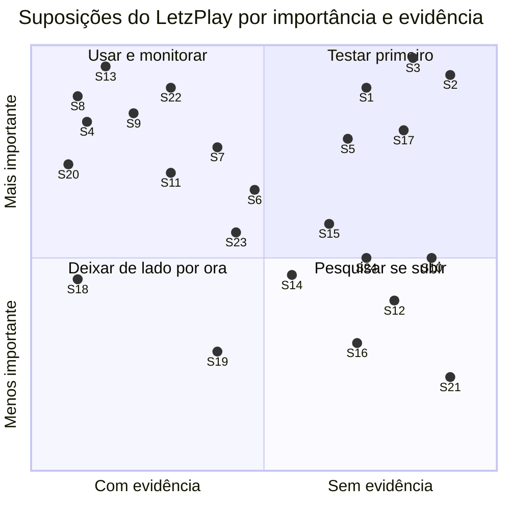

# 01 — Mapa de suposições

Todas as apostas implícitas no discovery e nos JTBDs, num quadrante **importância × evidência**. Mostra quais suposições são as mais arriscadas: importantes para o produto e com pouca evidência.

Técnica: *assumption mapping*, de David Bland (*Testing Business Ideas*, 2019). Códigos de fonte no [`README.md`](README.md).

> **Sem decisões de produto.** O mapa não diz o que construir. Diz em que o produto está apostando e quanto se sabe sobre cada aposta.

---

## Como a técnica funciona

Uma **suposição** é algo que precisa ser verdade para o produto dar certo, mas que ninguém provou. Ela costuma estar escondida numa frase que soa como fato ("o ranking é o coração emocional do produto"). O trabalho do mapa é tirá-la do texto, escrever como uma afirmação testável e posicionar em dois eixos:

- **Importância (vertical):** se esta suposição estiver errada, quanto do produto cai junto?
- **Evidência (horizontal):** quanto do que sabemos vem de fonte observável, e não de premissa? Aqui vale a escala do discovery (Forte, Média, Fraca, Nenhuma).

Bland separa as suposições em três famílias, e a divisão ajuda a ver onde está o buraco:

| Família | Pergunta | No LetzPlay |
| --- | --- | --- |
| **Desejabilidade** | As pessoas querem isso? | O jogador quer ver a conta do ranking, confirmar resultado, consultar o adversário? |
| **Viabilidade** | Isso se sustenta como negócio? | O público é grande? Quem paga? Quem escolhe o app? |
| **Praticabilidade** (*feasibility*) | Dá para entregar? | Alguém lança o resultado a tempo? Os dados de pontuação existem? |

**Analogia com design:** é como um *moodboard* de riscos. No Figma, você não começa a tela pelo pixel; começa pelas perguntas que a tela precisa responder. Aqui, antes de desenhar qualquer tela, se lista o que precisa ser verdade para aquela tela ter sentido.

**Um detalhe do eixo de evidência:** "ter evidência" não quer dizer "estar confirmada". Uma suposição com evidência **contra** também fica à esquerda, porque já se sabe algo sobre ela: que provavelmente é falsa. Essas são tão valiosas quanto as confirmadas, e a tabela marca a direção.

---

## O mapa

**Como ler:** o canto superior direito é o quadrante de risco. O superior esquerdo tem o que já se sabe e importa (a favor ou contra). As posições são julgamento do agente a partir da tabela abaixo, não medida: duas suposições com o mesmo nível de evidência podem ficar em pontos diferentes para não se sobreporem.

---

## As suposições

**Colunas:** *Origem* diz de onde a suposição saiu (onde ela está implícita). *Evidência* dá o nível e a direção: **a favor**, **contra** ou **misto**. *Importância*: Alta quando derrubar a suposição muda o escopo do MVP ou o schema; Média quando muda uma superfície; Baixa quando muda um detalhe.

### Desejabilidade

| ID | Suposição | Origem | Evidência | Importância |
| --- | --- | --- | --- | --- |
| S1 | **O ranking é o principal motivo para abrir o app; o feed é secundário** | `CLAUDE.md` ("ranking é o coração emocional"); `DSC H4` | **Fraca, a favor.** Nenhum dado de uso. O único sinal indireto: o JTBD 4 é "o mais coberto pela oferta e o menos citado pela demanda" (`MAT`, padrões) | Alta |
| S2 | **O jogador aceita registrar no app o jogo que combinou no WhatsApp** | `DSC H2`; `CLAUDE.md` ("marcação acontece no WhatsApp") | **Nenhuma a favor; Fraca contra.** Nenhuma review pede (`MAT L10`); o Meu Ranking passou a apontar para o grupo de WhatsApp (`CON`) | Alta |
| S4 | **Confirmação do resultado pelo adversário, com prazo, basta para o resultado ser confiável** | `DSC` 2.1; primeira leitura de `MER O1` | **Forte, contra.** 8 threads de disputa em 2 apps; nenhum produto arbitra o veto (`VZA`, seção 1; `APR`, achado 1) | Alta |
| S5 | **Subir no ranking motiva e descer frustra: o ranking é um momento emocional** | `CLAUDE.md`; `docs/PRODUCT.md` (princípios) | **Fraca, a favor.** Só anedota de psicóloga do esporte ("aprender a lidar com a frustração", `PUB` 2.2). Nenhuma voz de jogador de BT sobre posição | Alta |
| S6 | **O jogador quer entender por que a posição mudou** | `MER O4`; `MAT L5` | **Média, a favor.** Na oferta, a conta está espalhada em abas (`APR`, O4). A voz vem de apps de *rating* (DUPR, UTR), não de ranking por pontos | Média |
| S7 | **Antes de um confronto, o jogador consulta o nível e o histórico do adversário** | JTBD 3 (`CLAUDE.md`); "perfil com duas leituras" (`docs/PRODUCT.md`) | **Média, a favor.** No BT, jogadores "analisam os perfis dos atletas já inscritos antes de se inscreverem" (`DOR D1`, RA2). O resto vem de fora do BT (18 threads sobre rating) | Alta |
| S8 | **Horário e aviso confiáveis no dia do torneio são uma dor de alto custo** | `MER O3`; `MAT L1` | **Forte, a favor.** W.O. em quartas de Brasileiro por falta de horário; "perdemos torneios"; o organizador confirma o lado dele (`DOR D4`, `D5`) | Alta |
| S9 | **A barreira do LetzPlay atual é confiabilidade e navegação, não falta de feature** | `DSC H6`; `MAT`, padrões | **Forte, a favor.** Células ⚠️ concentradas em confiabilidade; navegação é a dor mais citada (15 menções em 5 apps). Falta dado de uso | Alta |
| S10 | **Um feed automático de atividade traz o jogador de volta entre competições** | JTBD 4; `CLAUDE.md` ("conteúdo automático engaja") | **Fraca, a favor.** Analogia com o Strava (`DSC` 4.1, `RIN`). Demanda na amostra: 1 elogio e 1 queixa (`MER`, abaixo do corte) | Média |
| S12 | **O uso cai entre competições** | `CLAUDE.md`; `DSC H5` | **Fraca, a favor.** Premissa. Arenas indoor reduzem a sazonalidade (`DSC` 2.1) | Média |
| S14 | **O jogador quer descobrir competição por nível e região num lugar só** | `MER O8`; `MAT L7` | **Média, a favor.** 9 menções em 5 apps, quase todas fora do BT | Média |
| S15 | **Subir de categoria (D → C → B → A) é o eixo emocional da carreira amadora** | `PUB HP7`; `MER O9` | **Misto.** A regra é Forte (promoção formal na CBT, FCTBT, FPT). O valor para o jogador é Fraco. Na CBT a promoção é às vezes **involuntária** (`RAT` 6.2) | Média |
| S16 | **Um nível de BT que atravesse arenas e federações é desejado** | `MER O10` | **Fraca para o jogador** (1 pedido explícito, num app de padel); **Média para o organizador** (impugnação por ranking de outra federação, `ORG`, O10) | Média |
| S19 | **O público competitivo é adulto de 25 a 45 anos, classe A/B, com mulheres metade ou mais** | `PUB HP1`, `HP2` | **Média, a favor.** 4 estudos locais independentes; o dado da CBT diz o contrário e não tem método | Baixa |
| S20 | **Integridade de categoria (perfil único, sem *sandbagging*) importa ao jogador e ao organizador** | `MER O2`; `DOR D1` | **Forte, a favor.** Dor com mais tipos de fonte dos dois lados. Diretor de federação: "é o que também gera muito stress" | Alta |
| S21 | **O jogador quer marcar o jogo de ranking dentro do app** | `MAT L10` (Ranketes oferece) | **Nenhuma a favor.** Nenhuma review pede; o Ranketes tem uso quase nulo (`TDN`) | Baixa |
| S24 | **Entre competições, o jogador quer ver evidência de evolução** | JTBD 5 | **Média fora do BT, Fraca no BT.** Os concorrentes cobram por isso (`MAT L9`); no BT, 2 menções de "rating preso" | Média |

### Viabilidade

| ID | Suposição | Origem | Evidência | Importância |
| --- | --- | --- | --- | --- |
| S13 | **O jogador escolhe o app que usa** (implícita num app do jogador que conquista usuário direto) | Framing do redesign em `CLAUDE.md` e `docs/PRODUCT.md` | **Forte, contra.** 4 reviews em 3 apps dizem que usam porque a federação, a arena ou o circuito exige (`MER RS4`); o organizador federado também não escolhe (`ORG RO2`) | Alta |
| S17 | **O público competitivo é grande o bastante para sustentar o produto** | Premissa de lançamento em `docs/PRODUCT.md` | **Fraca, misto.** ~65 mil cadastros em circuitos × 1,1 mi praticantes estimados, sem metodologia (`PUB HP3`, `MER RS3`, `RS6`) | Alta |
| S18 | **O jogador não paga pelo app; se houver receita, vem do organizador** | `DSC` 4.2; `NEG` | **Forte, a favor.** Nenhum app de BT cobra o jogador (`MAT`, table stakes). Cobrar gera revolta (MATCHi, `VZA`) e o Ranketes tenta com uso quase nulo | Média |
| S22 | **O WhatsApp pode ser substituído como canal do dia do torneio e da marcação** | Implícita nas oportunidades O3 e O1 | **Média a Forte, contra.** Quem tentou substituir passou a apontar para ele (`MER RS5`); até quem tem sistema próprio depende dele (`ORG RO3`, GH #72) | Alta |

### Praticabilidade

| ID | Suposição | Origem | Evidência | Importância |
| --- | --- | --- | --- | --- |
| S3 | **Alguém da operação lança o resultado a tempo sem o app controlar a operação:** o jogador no ranking de arena, o organizador no torneio | `DSC H1`; `ORG RO1` | **Consequência Forte, causa Fraca.** Resultados parados por meses são bem documentados; **por que** atrasam, ninguém explicou (`DOR D6`) | Alta |
| S11 | **Ranking individual, com a dupla derivada, representa o público do beta** | `DSC H3`, 2.4 | **Forte na regra, sem dado do público.** Padrão dominante em CBT, federações, ITF, CBBT e na maioria das arenas; dupla fixa numa minoria | Alta |
| S23 | **Dá para mostrar a conta dos pontos com os dados que o organizador fornece** | `MER O4`; `APR`, O4 | **Média, misto.** As tabelas existem, mas variam por organizador, têm bônus comerciais de até +30% e dupla chancela (`APR`, achado 4) | Média |

---

## Leitura por quadrante

### Testar primeiro (importante, pouca evidência)

As cinco mais altas, em ordem de risco (importância primeiro, depois ausência de evidência):

| # | ID | Por que é arriscada | O que cai se estiver errada |
| --- | --- | --- | --- |
| 1 | **S3** | Sem resultado lançado, os JTBDs 2, 3 e 5 ficam vazios (`DSC H1`). A causa do atraso não foi observada | O ranking, o H2H e a evolução mostram dados velhos. O que o app do jogador pode prometer muda (`ORG RO1`) |
| 2 | **S2** | Nenhum sinal a favor, e o concorrente com melhor nota foi na direção oposta | Todo fluxo que depende do jogador lançar resultado de ranking de arena |
| 3 | **S1** | É a premissa que organiza o produto inteiro, e não tem nenhum dado de uso | A arquitetura de informação (qual aba é a primeira) e o peso do feed |
| 4 | **S17** | Afeta qualquer tese de lançamento; os números de mercado não têm metodologia | O público do beta e a relação com federações e circuitos |
| 5 | **S5** | É princípio de design declarado ("ranking como momento emocional"), com uma anedota como fonte | O tom da tela de ranking e o tratamento de subida e descida |

Logo abaixo: **S15** (progressão de categoria) e **S24** (evolução), ambas sobre o JTBD 5, com regra forte e valor não medido.

### Usar e monitorar (importante, com evidência)

- **A favor:** S8 (horário no dia do torneio), S9 (confiabilidade e navegação), S20 (integridade de categoria), S11 (ranking individual, na regra), S7 (consultar adversário, com um sinal do BT). Dá para desenhar em cima delas; vale confirmar em entrevista, mas não são o gargalo.
- **Contra:** S4, S13 e S22. São as suposições que **a evidência já derrubou em parte**. Elas não pedem teste para saber se são verdade; pedem uma pergunta de produto sobre o que fazer sabendo que provavelmente são falsas. Essas perguntas estão no `README.md` e nas pesquisas de origem (`APR`, pergunta 1; `MER`, pergunta 5).

### Pesquisar se subir e deixar de lado por ora

- S10 (feed), S12 (queda entre competições), S14 (descoberta), S16 (nível transversal) e S21 (marcação no app) têm pouca evidência, mas hoje não mudam o escopo do MVP. Se alguma subir de importância (por exemplo, se o feed virar a aposta de retenção), passa para o quadrante de risco.
- S18 e S19 têm evidência e importância média-baixa para o MVP.

---

## De onde saiu cada suposição

Um mapa rápido de quais artefatos desta pasta tocam cada suposição, para seguir o fio:

| ID | Árvore (2) | Forças (3) | Job map (4) | Blueprint (5) | Personas (6) | Kano (7) | Plano (8) |
| --- | --- | --- | --- | --- | --- | --- | --- |
| S1 | ✓ | | ✓ | | ✓ | | ✓ |
| S2 | ✓ | ✓ | ✓ | | ✓ | ✓ | ✓ |
| S3 | ✓ | ✓ | ✓ | ✓ | | | ✓ |
| S4 | ✓ | ✓ | | ✓ | | ✓ | |
| S5 | ✓ | ✓ | ✓ | | ✓ | | ✓ |
| S7 | ✓ | | ✓ | | ✓ | ✓ | ✓ |
| S8 | ✓ | ✓ | ✓ | ✓ | | ✓ | |
| S13 | | ✓ | | ✓ | ✓ | | ✓ |
| S15 | ✓ | | ✓ | | ✓ | ✓ | ✓ |
| S17 | | | | | ✓ | | ✓ |
| S22 | ✓ | ✓ | | ✓ | | | ✓ |
| S24 | ✓ | | ✓ | | ✓ | ✓ | ✓ |

---

## Limites deste mapa

- **As posições são julgamento, não medida.** O objetivo de Bland é a conversa que o mapa provoca, não a coordenada exata. Dois leitores podem discordar da altura de S1; o importante é que ambos concordem que ela está do lado direito.
- **As suposições do organizador estão sub-representadas** porque a visão do organizador está fora do MVP. Mesmo assim, S3, S13 e S22 dependem dele.
- **Faltam suposições de praticabilidade técnica** (Supabase, notificação push, integração). Não entram porque o discovery não produziu evidência sobre elas.
