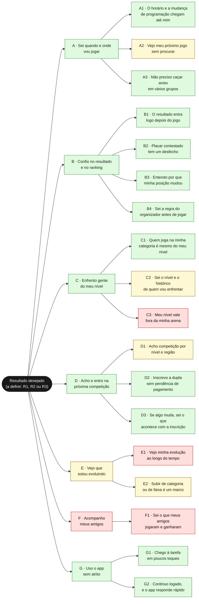
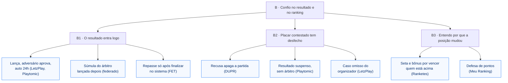

# 02 — Árvore de oportunidades

O espaço do problema organizado como árvore: **resultado desejado → oportunidades (dores e desejos) → exemplos de soluções que o mercado já tentou**. A árvore não escolhe solução; ela mostra o terreno onde a escolha vai acontecer.

Técnica: *Opportunity Solution Tree* (OST), de Teresa Torres (*Continuous Discovery Habits*, 2021). Códigos de fonte no [`README.md`](README.md).

> **Sem decisões de produto.** A raiz da árvore (o resultado desejado) fica em aberto de propósito: escolher o *outcome* é decisão de produto. As soluções listadas são o que existe no mercado, não recomendações.

---

## Como a técnica funciona

Torres organiza o discovery em quatro camadas:

1. **Resultado desejado** (*outcome*): uma métrica que o time consegue mover. Não é "lançar o feed"; é algo como "mais jogadores voltam toda semana".
2. **Oportunidades:** necessidades, dores e desejos do cliente que, se atendidos, movem o resultado. São escritas **do ponto de vista do cliente** ("não sei a que horas é meu próximo jogo"), nunca como feature ("notificação push").
3. **Soluções:** formas de atender uma oportunidade. Várias por oportunidade, para comparar.
4. **Experimentos:** testes das suposições por trás de cada solução. Esta árvore para na camada 3; os testes estão no [`08-plano-validacao.md`](08-plano-validacao.md).

Duas regras de Torres que moldam esta árvore:

- **Oportunidades têm pai e filho.** Uma oportunidade grande ("confiar no ranking") se quebra em menores ("o resultado entra rápido", "entendo a conta"). O time escolhe uma folha pequena o bastante para resolver, não o galho inteiro.
- **Sem pular direto para a solução.** A árvore existe para que a pergunta "o que construir?" venha depois de "qual dor, de quem, com que evidência?".

**Analogia com design:** é a hierarquia de um *design brief*. O objetivo de negócio no topo, as necessidades do usuário no meio, as ideias de tela embaixo. A diferença é que aqui cada nó carrega a força da evidência que o sustenta.

---

## A raiz: três resultados candidatos

Torres pede **um** resultado por árvore. A evidência sustenta pelo menos três candidatos, e cada um puxa a árvore para um lado diferente. A escolha está nas perguntas abertas do `README.md`.

| Candidato | Métrica (proposta do discovery) | Galhos mais próximos | Evidência de que importa |
| --- | --- | --- | --- |
| **R1. Resultado confiável** | % de partidas com resultado confirmado em até 24h e em 7 dias (`DSC H1`) | B, C | Forte: é a dor nº 1 do top 10 (`MER O1`) e a base dos JTBDs 2, 3 e 5 |
| **R2. Retorno do jogador** | Jogadores que voltam ao app toda semana ao longo de um ciclo de ranking (`DSC H5`) | E, F, B | Fraca: premissa de que o uso cai entre competições (`S12`) |
| **R3. Tarefa do dia sem atrito** | Tempo ou toques para ver próximo jogo, posição e resultado a confirmar (`DSC H6`) | A, G | Forte: navegação é a dor mais citada (15 menções em 5 apps, `MER O6`) |

A árvore abaixo mostra todos os galhos com uma raiz neutra. Com o resultado escolhido, os galhos distantes dele saem de cena, e a árvore fica mais estreita.

---

## A árvore: resultado → oportunidades

Oportunidades escritas na voz do jogador. A cor indica a força da evidência da oportunidade.

**Legenda:** verde = Forte, amarelo = Média, vermelho = Fraca. Um galho herda a cor da sua folha mais forte; as folhas carregam a força própria, detalhada abaixo.

---

## Os galhos, com evidência e soluções vistas no mercado

Cada galho lista suas folhas com a fonte, e depois o que o mercado já tentou para aquela folha. "Solução vista" quer dizer que existe num produto ou numa gambiarra observada, não que funciona.

### A · Sei quando e onde vou jogar

| Folha | Evidência | Força | Suposições |
| --- | --- | --- | --- |
| A1 · O horário e a mudança chegam até mim | W.O. em quartas de Brasileiro; "perdemos torneios"; o regulamento põe no atleta a responsabilidade de acompanhar (`MER O3`, `DOR D5`) | Forte | S8, S22 |
| A2 · Vejo meu próximo jogo sem procurar | "Sempre que entro no app é necessário ficar procurando a informação" (`MER O6`) | Média (a dor é de navegação geral; o recorte "próximo jogo" é inferência) | S9 |
| A3 · Não caço aviso em vários grupos | Grupo de WhatsApp por torneio é o canal de programação, chamada, denúncia e cobrança (`DOR D4`) | Forte | S22 |

| Solução vista | Onde | Folha | Fonte |
| --- | --- | --- | --- |
| Grupo de WhatsApp por torneio, com *template* de aviso | Organizadores, Nômades BT | A1, A3 | `DOR D4`, `JOR` |
| Link do grupo de WhatsApp exibido após a inscrição | Meu Ranking | A3 | `CON` |
| Dia, hora e local por jogo na chave | LetzPlay atual | A2 | `APR`, O3 |
| Notificação de rodada | Meu Ranking | A1 | `MAT` |
| App dedicado à programação ao vivo | LiveBT (desde 2019) | A1 | `MER O3` |
| Chamada por som e rádio comunicador | Mesa de arbitragem | A1 | `JOR` 1.2 |

### B · Confio no resultado e no ranking

| Folha | Evidência | Força | Suposições |
| --- | --- | --- | --- |
| B1 · O resultado entra logo depois do jogo | "2 meses e os jogos ainda estão pendentes"; 3º lugar sem lançar por 10 dias (`MER O1`, `DOR D6`) | Forte (consequência) | S3 |
| B2 · Placar contestado tem desfecho | 8 threads em 2 apps; nenhum produto arbitra (`VZA`, seção 1) | Forte (fora do BT) | S4 |
| B3 · Entendo por que minha posição mudou | Tabela numa aba e total noutra; bônus comerciais; dupla chancela (`APR`, O4) | Forte na oferta; voz do BT ausente | S6, S23 |
| B4 · Sei a regra do organizador antes de jogar | 13 menções em 6 apps; "Basta pedir para o organizador mudar o formato" (`MER O5`) | Forte | S13 |

| Solução vista | Onde | Folha | Fonte |
| --- | --- | --- | --- |
| Jogador lança → adversário aprova → auto-aprovação em 24h | LetzPlay (rankings configurados), Playtomic | B1 | `APR`, correções |
| Validação pelo adversário; qualquer recusa apaga a partida | DUPR | B1, B2 | `VZA` |
| Resultado "suspenso" quando contestado; a plataforma "não tem autoridade para obrigar" | Playtomic | B2 | `VZA` |
| Contestação vira "caso omisso" do organizador | LetzPlay | B2 | `VZA` |
| Súmula em papel do árbitro, lançada depois | Torneio federado | B1 | `JOR` 1.2 |
| Repasse ao organizador só depois de finalizar no sistema | FET | B1 | `DOR D6`, `D8` |
| Seta de subida e queda; bônus de até 1,6× por vencer quem está acima | Ranketes | B3 | `APR`, O4 |
| "Defesa de pontos" | Meu Ranking | B3 | `MAT` |
| Tabela de pontos única e pública | Ranketes | B4 | `APR`, pergunta 2 |

**Exemplo do galho B expandido até a solução,** como Torres desenha:

**Leitura descritiva:** no galho B, as soluções do mercado cobrem B1 e B3 de formas variadas, e **nenhuma cobre B2**: todas devolvem a disputa para alguém de fora do app. É o buraco que a pesquisa de aprofundamento já apontou (`APR`, pergunta 1).

### C · Enfrento gente do meu nível

| Folha | Evidência | Força | Suposições |
| --- | --- | --- | --- |
| C1 · Quem joga na minha categoria é do meu nível | *Sandbagging* e perfil duplicado em 4 apps; federação diz não ter método (`MER O2`, `DOR D1`) | Forte (dos dois lados) | S20 |
| C2 · Sei o nível e o histórico do adversário | Jogadores olham os perfis dos inscritos antes de se inscrever (`DOR D1`, RA2); H2H é table stakes (`MAT`) | Média | S7 |
| C3 · Meu nível vale fora da minha arena | 1 pedido explícito de jogador; demanda do organizador em impugnação (`MER O10`, `ORG`) | Fraca (jogador) | S16 |

| Solução vista | Onde | Folha | Fonte |
| --- | --- | --- | --- |
| Validação por CPF, como opção do gestor | LetzPlay | C1 | `DOR D1` (RA2) |
| Promoção obrigatória (top 8 nacional; campeão da iniciante sobe) | CBT, FCTBT, FPT | C1 | `RAT` 6.2, `DOR D1` |
| Foto no WhatsApp e consulta a outra plataforma | Organizadores | C1 | `DOR`, gambiarras |
| Nível com selo de verificação | UTR (Verified) | C1, C2 | `MAT` |
| Nível com índice de confiabilidade | DUPR (Reliability Score) | C1, C2 | `MAT`, `RAT` |
| H2H entre jogadores | LetzPlay, Meu Ranking, Ranketes (da temporada) | C2 | `MAT` |
| Adversários em comum | Match! Tennis | C2 | `DSC` 3.3 |
| Rating que atravessa clubes | DUPR, UTR, Playtomic (fora do BT) | C3 | `RAT` |

### D · Acho e entro na próxima competição

| Folha | Evidência | Força | Suposições |
| --- | --- | --- | --- |
| D1 · Acho competição por nível e região | Filtros ruins: 9 menções em 5 apps, quase todas fora do BT (`MER O8`) | Média | S14 |
| D2 · Inscrevo a dupla sem pendência | Inscrição só vale quando os dois pagam; inadimplente removido à mão (`DOR D2`) | Forte | — |
| D3 · Se algo muda, sei o que acontece com a inscrição | Troca de parceiro sem resposta por 2 semanas; R$ 438 perdidos (`DOR D3`) | Forte | — |

| Solução vista | Onde | Folha | Fonte |
| --- | --- | --- | --- |
| Lista de torneios com filtros | LetzPlay, Meu Ranking, Playtomic, UTR | D1 | `MAT` |
| Atletas por distância | Ranketes | D1 | `MAT` |
| Partidas abertas por nível | Playtomic | D1 | `MAT` |
| Inscrição confirmada só com os dois pagamentos | TF Sports | D2 | `DOR D2` |
| PIX na chave do organizador + comprovante | Organizadores | D2 | `DOR D2` |
| Área de "duplas incompletas" para trocar parceiro | Sistema de academia (GH) | D3 | `DOR D3` |
| *Alternate* pagando PIX na hora | FET | D3 | `DOR D3` |

### E · Vejo que estou evoluindo

| Folha | Evidência | Força | Suposições |
| --- | --- | --- | --- |
| E1 · Vejo minha evolução ao longo do tempo | "Rating preso": 2 menções + 3 threads, fora do BT (`MAT L9`) | Fraca no BT | S24 |
| E2 · Subir de categoria é um marco | Regra formal em federações; valor emocional não medido (`MER O9`, `PUB HP7`) | Média | S15, S5 |

| Solução vista | Onde | Folha | Fonte |
| --- | --- | --- | --- |
| Gráfico de evolução no plano pago | Playtomic Premium, UTR Power, DUPR+ | E1 | `MAT` |
| Painel de desempenho | LetzPlay atual | E1 | `MAT` |
| Selo de top 10 | Ranketes | E2 | `MAT` |
| Zona de promoção na liga | Duolingo | E2 | `DSC`, `REF` 01 |
| Retrospectiva do ano | Strava (pago), Rivals | E1 | `MAT L12` |

### F · Acompanho meus amigos

| Folha | Evidência | Força | Suposições |
| --- | --- | --- | --- |
| F1 · Sei o que meus amigos jogaram e ganharam | Oferta abundante, demanda quase nula (1 elogio, 1 queixa); analogia com Strava (`MER`, abaixo do corte) | Fraca | S10 |

| Solução vista | Onde | Fonte |
| --- | --- | --- |
| Seguir, torcer, comentar | LetzPlay atual, Ranketes | `MAT` |
| Kudos e feed de atividade | Strava | `RIN`, `REF` 02 |

### G · Uso o app sem atrito

| Folha | Evidência | Força | Suposições |
| --- | --- | --- | --- |
| G1 · Chego à tarefa em poucos toques | "Mais que 3 cliques pra ver informação simples" (`MER O6`) | Forte | S9 |
| G2 · Continuo logado, e o app responde rápido | Lentidão 13, conta e login 8, suporte 9 menções; correções de sessão recorrentes desde 2022 (`MER O7`, `APR`) | Forte | S9 |

| Solução vista | Onde | Fonte |
| --- | --- | --- |
| Tab bar com 4 ou 5 destinos (28 de 28 apps de esporte) | Mercado | `REF` 07 |
| Versão para "preservar a sessão após atualizações" | LetzPlay v11 | `MER O7` |

---

## O que a árvore mostra (leitura descritiva)

- **Os galhos com evidência mais forte (A, B, C, G) são os que dependem de terceiros.** Horário depende do árbitro; resultado, do organizador ou do adversário; categoria, da federação. O galho que o app do jogador controla sozinho (G) é o de fundação. Essa é a mesma cadeia de responsabilidade do `DOR`, vista de outro ângulo.
- **Os galhos E e F são os que o jogador controla sozinho, e são os de evidência mais fraca.** Evolução e social dependem só de dados que já existem, mas ninguém na amostra pediu.
- **O galho D quase não aparece nos JTBDs do jogador** e é o mais forte do lado do organizador (`DOR D2`, `D3`). A inscrição e o pagamento estão fora do MVP (`docs/PRODUCT.md`).
- **Nenhuma solução do mercado cobre B2** (placar contestado). É a única folha forte sem solução observada.

---

## Limites

- **A árvore reflete a evidência, não o jogador.** Torres constrói a árvore a partir de entrevistas semanais; esta foi construída de pesquisa de mesa. As oportunidades estão na voz do jogador, mas foram escritas pelo agente.
- **Uma árvore por resultado.** Com três candidatos, esta é uma árvore "larga" de propósito. Depois da escolha, vale redesenhar só com os galhos próximos.
- **As soluções não são exaustivas.** São as que as pesquisas de origem encontraram.
