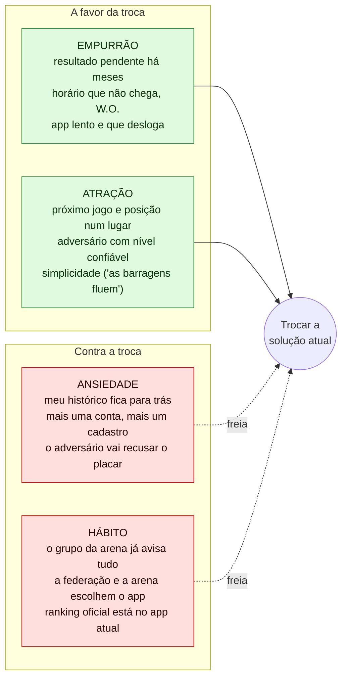
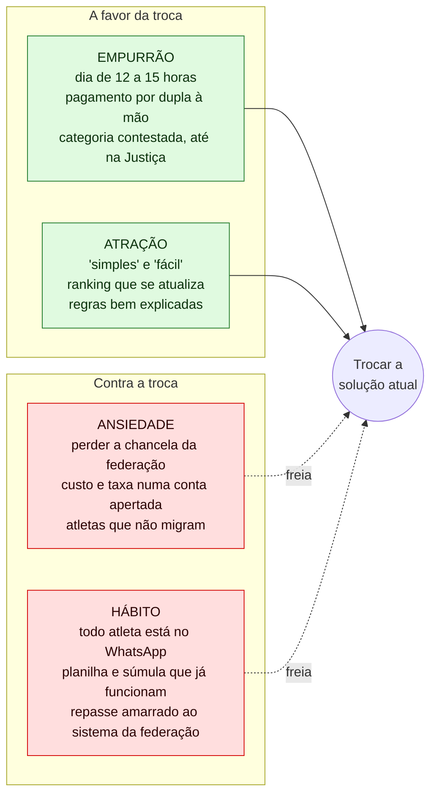

# 03 — Forças do progresso

O que faz o jogador e o organizador **trocarem** a solução atual (WhatsApp, planilha, LetzPlay atual, a plataforma da federação) por outra, e o que os segura onde estão.

Técnica: *forces of progress* do Jobs to be Done, de Bob Moesta (*Demand-Side Sales 101*, 2020; *switch interview* com Chris Spiek). Códigos de fonte no [`README.md`](README.md).

> **Sem decisões de produto.** As forças descrevem o que a evidência mostra sobre a troca. Não dizem se o LetzPlay deve disputar essa troca, nem como.

---

## Como a técnica funciona

Moesta diz que ninguém "adota" um produto: a pessoa **troca** uma solução por outra quando está tentando fazer progresso numa situação. Quatro forças agem sobre essa troca:

| Força | Direção | Pergunta |
| --- | --- | --- |
| **Empurrão** (*push*) da situação atual | A favor da troca | O que na forma atual está incomodando a ponto de a pessoa procurar outra? |
| **Atração** (*pull*) da nova solução | A favor da troca | O que a pessoa imagina que a vida vai ser com a nova solução? |
| **Ansiedade** (*anxiety*) com a nova | Contra a troca | O que pode dar errado se ela trocar? |
| **Hábito** (*habit*) da atual | Contra a troca | O que a prende ao jeito atual, mesmo incomodada? |

A troca só acontece quando **empurrão + atração > ansiedade + hábito**. O erro comum é investir só na atração (mais features) e ignorar as forças contra.

**Analogia com design:** é o motivo pelo qual uma pessoa continua no Sketch mesmo reclamando dele. O empurrão existe, o Figma atrai, mas os arquivos antigos, os plugins e o time que ainda usa o Sketch seguram. Quem desenha o Figma precisa pensar no import, não só no editor.

**"Solução atual" aqui é um conjunto.** O jogador de BT não usa um app: usa o grupo de WhatsApp da arena, o app que a federação ou o circuito escolheu (muitas vezes o LetzPlay atual), o Instagram e a memória. O organizador soma a isso a planilha, a súmula em papel e o PIX na chave dele. As forças abaixo são sobre sair desse conjunto.

---

## Jogador competitivo

### Empurrão: o que incomoda na forma atual

| Força | Evidência | Força da evidência |
| --- | --- | --- |
| **Resultado que não entra.** Jogo pendente por meses; 3º lugar sem lançar | "2 meses e os jogos ainda estão pendentes!" (LetzPlay); "Não lançaram meu 3º lugar" (Reclame Aqui) (`MER O1`) | Forte |
| **Horário e mudança que não chegam.** Perda de jogo por W.O. | W.O. em quartas de Brasileiro; "perdemos torneios"; "O app não notifica por push, somente por e-mail" (`MER O3`) | Forte |
| **App que atrapalha.** Lentidão, logout, informação escondida | Navegação: 15 menções em 5 apps. Lentidão: 13. "começou a deslogar os usuários depois de poucos minutos" (`MER O6`, `O7`) | Forte |
| **Adversário fora da categoria.** *Sandbagging* e perfil duplicado | 6 menções em 4 apps; "compromete o equilíbrio dos torneios" (`MER O2`, `DOR D1`) | Forte |
| **Aviso espalhado.** Um grupo por torneio, por ranking, por arena | Grupo de WhatsApp é canal de programação, denúncia e cobrança (`DOR D4`) | Forte (lado do organizador); a voz do jogador sobre o excesso de grupos é inferência |
| **Não entender a conta** | Voz vem de apps de rating; no BT, a conta está espalhada em abas (`MER O4`, `APR`) | Média |

### Atração: o que a nova solução promete

| Força | Evidência | Força da evidência |
| --- | --- | --- |
| **Tudo do meu dia competitivo num lugar** | Elogio mais recorrente da amostra: "achar jogo, torneio e gente do mesmo nível" (6 em 3 apps, fora do BT) (`MER O8`) | Média |
| **Simplicidade** | Meu Ranking, melhor nota do BT (4,5★), com reviews que elogiam que "as barragens fluem" (`MER O6`) | Média |
| **Nível em que dá para confiar** | Sistemas maduros mostram número + confiança; é o tema mais discutido fora das lojas (`MER O2`, `RAT`) | Média (fora do BT) |
| **Ver a evolução** | Os concorrentes cobram por isso; "Stuck at 2.5 DUPR … Now Playing at 4.0" (`MER O9`, `MAT L9`) | Fraca no BT |

### Ansiedade: o que pode dar errado se trocar

| Força | Evidência | Força da evidência |
| --- | --- | --- |
| **Perder o histórico.** Os resultados antigos ficam no app antigo | "os resultados registrados na plataforma são importantes para o meu histórico e para a ... classificação em outros torneios" (`DOR`, RA1) | Média (o valor do histórico é dito; o medo de perdê-lo é inferência) |
| **Mais uma conta.** O jogador já tem uma conta por arena e por federação | "O jogador tem uma conta por arena" (`DSC` 2.2); CPF preso numa conta cancelada (Tênis Integrado, `MER O7`) | Média |
| **Placar recusado.** Confirmar pelo adversário abre espaço para o perdedor vetar | 8 threads em 2 apps (`VZA`, seção 1) | Forte (fora do BT) |
| **Cobrança.** O app novo pode cobrar | MATCHi: 5 das 10 reviews visíveis reclamam da taxa ao jogador ("a gente se sente preso") (`VZA`) | Média (fora do BT) |
| **O número me expor ou mentir** | "My rating is such a lie"; queda por causa do parceiro, em duplas (`RAT`, `APR`) | Média (fora do BT) |

### Hábito: o que prende ao jeito atual

| Força | Evidência | Força da evidência |
| --- | --- | --- |
| **O grupo de WhatsApp já resolve** o dia do torneio e a marcação | O Meu Ranking passou a apontar para o grupo; o regulamento de arena usa o grupo como canal oficial (`MER RS5`, `JOR` 2) | Média a Forte |
| **Quem escolhe o app é a federação, a arena ou o circuito** | 4 reviews em 3 apps; white-label por arena (`MER RS4`) | Forte |
| **O ranking oficial está no app atual.** Sem ele, os pontos não contam | CBT: sem anuidade, pontos não contam; CBBT roda no LetzPlay com 25.894 jogadores (`RAT` 6.2, 6.3) | Forte |
| **A conversa social mora no grupo** | Prefere jogar com amigos; BT como "grupo de pertencimento" (`PUB` 1.2, 2.3) | Fraca |

### Leitura para o jogador

- **O empurrão é forte e bem documentado; a atração, nem tanto.** A evidência diz com clareza o que incomoda e bem menos o que o jogador imagina de melhor. É o padrão de quem ainda não viu a alternativa.
- **O hábito mais forte não é do jogador: é de quem escolhe por ele.** Para o jogador federado, "trocar" pode nem ser uma opção. Isso liga as forças à suposição `S13` (o jogador escolhe o app), que tem evidência **contra**.
- **A ansiedade mais específica do BT é o histórico.** É o que um jogador perde ao trocar e o que o organizador guarda.

---

## Organizador

### Empurrão

| Força | Evidência | Força da evidência |
| --- | --- | --- |
| **O dia do torneio é longo e físico** | Chegar 8h30, sair perto das 23h; rádio comunicador entre quadras (`DOR D5`, `JOR` 1.2) | Forte |
| **Categoria certa e decisão contestada** | "é o que também gera muito stress"; impugnação levada à Justiça (`DOR D1`) | Forte |
| **Pagamento por dupla** | Dois pagamentos por inscrição; "Os inadimplentes são removidos automaticamente? Não" (`DOR D2`) | Forte |
| **Mudança de última hora pelo WhatsApp** | Pedido de troca de parceiro sem resposta por duas semanas (`DOR D3`, `D4`) | Forte |
| **A ferramenta não cobre o formato** | Planilha encomendada por R$ 30+; construtor que escreveu o próprio sistema (`DOR D9`) | Média |

### Atração

| Força | Evidência | Força da evidência |
| --- | --- | --- |
| **Simples e fácil** | 8 de 10 reviews do Meu Ranking Organizador (4,9★) elogiam isso (`APR`, O6; `VZA`) | Média |
| **Ranking que se mantém** | "quase 80 pessoas em nosso ranking e ... todos os clientes elogiam a praticidade" (`DOR D7`, AS1) | Média (uma fala) |
| **Regras explicadas** | Organizadores elogiam o app que tem "bem explicado as regras" (`ORG`, O5) | Fraca (uma fala) |
| **Integridade como argumento** | *Sandbagging* custa a credibilidade do torneio (`DSC` 4.2) | Média |

### Ansiedade

| Força | Evidência | Força da evidência |
| --- | --- | --- |
| **Perder a chancela ou virar "paralelo"** | A CBT exige homologação de todo torneio de BT e veta "organizações paralelas" (`APR`, achado 2) | Forte (regra lida) |
| **Custo numa conta que fecha no limite** | Inscrição "cobre parte do custo operacional"; "coisas básicas são pagas" (outro esporte) (`DOR D8`) | Média |
| **Os atletas não migrarem** | Inferência: o organizador depende de todos os atletas estarem no mesmo canal (GH #72 precisou tornar o WhatsApp obrigatório) | Fraca (inferência) |
| **Perder o ranking em curso** | Inferência a partir do ciclo de semestre (`JOR` 2) | Fraca (inferência) |

### Hábito

| Força | Evidência | Força da evidência |
| --- | --- | --- |
| **Todo atleta já está no WhatsApp** | Canal de programação, desafio, resultado, cobrança e suporte (`DOR D4`; `ORG RO3`) | Forte |
| **O que já funciona à mão** | Súmula em papel, planilha, PIX com comprovante, formulário no site (`DOR`, gambiarras) | Forte |
| **O sistema da federação amarra o dinheiro** | Repasse de 80% só depois de finalizar no sistema e enviar nota fiscal (`JOR` 1.3) | Forte (regra lida) |
| **A federação escolhe a ferramenta** | Federação usa Tênis Integrado; CBBT usa LetzPlay; circuitos usam app próprio (`ORG RO2`) | Forte |

### Leitura para o organizador

- **É o ator com as forças mais fortes dos dois lados.** O empurrão é forte (dor documentada em primeira pessoa), e o hábito também (o dinheiro e a chancela passam pelo sistema atual).
- **A ansiedade dele é institucional, não de interface.** Perder a chancela, o repasse e o ranking pesa mais do que aprender uma tela nova.
- **O organizador pequeno de arena e o de etapa federada têm forças diferentes.** O primeiro não depende de repasse de federação e usa o torneio como marketing (`ARE`). A evidência é mais fraca para ele (`DOR`, ressalva).

---

## As duas trocas juntas

O que a evidência sugere quando se olha os dois atores lado a lado. Descritivo.

| Ponto | Jogador | Organizador |
| --- | --- | --- |
| Quem decide a troca | Muitas vezes não é ele | A federação, quando há chancela; ele mesmo, no ranking de arena |
| Força mais forte a favor | Resultado e horário (dependem do organizador) | O dia do torneio e o pagamento por dupla |
| Força mais forte contra | O ranking oficial está no app atual | A chancela e o repasse |
| O WhatsApp | Hábito do grupo; resolve o aviso | Hábito de todos; resolve comunicação e cobrança |
| Onde os empurrões coincidem | Categoria justa, menos pendência, um canal só (`DOR`, "onde querem a mesma coisa") | idem |

**O que isso diz sobre as suposições:** as forças contra a troca são a razão de `S13` (o jogador escolhe o app) e `S22` (o WhatsApp é substituível) terem evidência contrária. E a troca do jogador depender do organizador é o mesmo risco de `S3` (alguém lança o resultado a tempo).

---

## Limites

- **Moesta tira as forças de entrevistas de troca**, com pessoas que acabaram de trocar de solução. Aqui não houve nenhuma. As forças vêm de reviews, regulamentos e vídeos, e a **atração e a ansiedade são as mais frágeis**, porque quase ninguém escreve publicamente o que imaginava ou temia antes de trocar.
- **O "LetzPlay atual" aparece dos dois lados.** Para muitos jogadores ele é a solução atual; o redesign é outro LetzPlay. A relação entre os dois é pergunta aberta das pesquisas de origem (`MER`, pergunta 1).
- O roteiro de entrevista de troca para confirmar estas forças está no [`08-plano-validacao.md`](08-plano-validacao.md).
