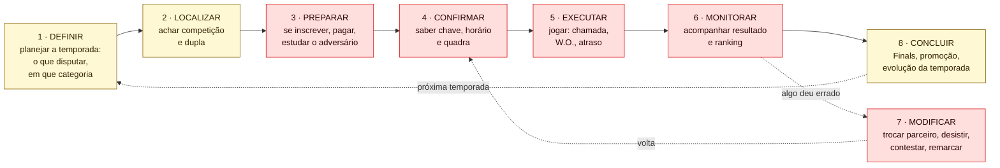

# 04 — Mapa do job: competir em Beach Tennis

As etapas do trabalho que o jogador competitivo tenta fazer, **independentes de qualquer ferramenta**, com as dores de cada etapa e os resultados que ele busca em cada uma.

Técnica: *job map* do *Outcome-Driven Innovation*, de Tony Ulwick (*Jobs to Be Done: Theory to Practice*, 2016). Códigos de fonte no [`README.md`](README.md).

> **Sem decisões de produto.** O mapa descreve o trabalho do jogador. Não diz em qual etapa o LetzPlay deve atuar.

---

## Como a técnica funciona

Ulwick parte de uma ideia: o **job** (o trabalho que a pessoa quer fazer) é estável, e as soluções mudam. O jogador de BT competia antes do app e vai competir depois dele. Por isso o mapa descreve o **que** o jogador faz, nunca **com o quê**. "Ver o ranking no app" é solução; "saber onde estou" é job.

Todo job, segundo Ulwick, passa por até 8 etapas universais: **definir, localizar, preparar, confirmar, executar, monitorar, modificar e concluir**. As 6 etapas da issue (planejar, se inscrever, se preparar, jogar, acompanhar resultado, evoluir) se encaixam nelas.

Em cada etapa, Ulwick escreve os **resultados desejados** (*desired outcomes*) num formato fixo:

> **direção** + **métrica** + **objeto** + **contexto**
> *Minimizar* + *o tempo para* + *saber a hora do meu próximo jogo* + *no dia do torneio*

O formato é chato de propósito: toda frase vira uma pergunta de pesquisa ("quão importante é isso para você? quão satisfeito você está hoje?"). É daí que sai a pontuação de oportunidade da proposta do Tally ([`09-proposta-tally.md`](09-proposta-tally.md)).

**Analogia com design:** é um *journey map* sem personagem e sem produto. A jornada descreve a experiência de alguém com um serviço; o job map descreve o trabalho, e serve para qualquer serviço que tente ajudar nele.

**Job principal:** *competir em Beach Tennis ao longo de uma temporada, para subir de posição e de categoria.*

---

## O mapa

**Legenda:** vermelho = etapa com dor de evidência **Forte**; amarelo = **Média**. A cor fala da força da evidência da dor, não do tamanho dela.

**Correspondência com os JTBDs do `CLAUDE.md`:**

| JTBD | Etapas do mapa |
| --- | --- |
| 1. Encontrar competição | 1, 2 (e 3, na inscrição) |
| 2. Saber onde estou no ranking | 6 |
| 3. Preparar-me para um confronto | 3 |
| 4. Acompanhar amigos no BT | Fora do job principal (é um job relacionado, social) |
| 5. Sentir que estou evoluindo | 8 |

As etapas 4, 5 e 7 **não têm JTBD próprio** e são justamente três das cinco com dor Forte. É o que o mapa acrescenta aos JTBDs.

---

## Duas variações do mesmo job

O mapa muda de dono conforme o formato. O [`05-service-blueprint.md`](05-service-blueprint.md) detalha o torneio.

| Etapa | Ranking de arena (desafio) | Torneio |
| --- | --- | --- |
| 2 · Localizar | O ranking é da arena onde o jogador já joga | Busca entre 8+ plataformas, Instagram e grupos |
| 4 · Confirmar | O jogador combina data e quadra, no WhatsApp, com 3 opções de horário (`JOR` 2) | O organizador publica chave e programação, "preferencialmente" 48h antes (`JOR` 1.1) |
| 5 · Executar | Jogo marcado entre as duplas | Chamada por som; W.O. em 15 min (`JOR` 1.2) |
| 6 · Monitorar | **O jogador** informa o placar; a comissão aprova (`JOR` 2) | **O árbitro ou o organizador** lança depois (`JOR` 1.3) |
| 7 · Modificar | Prazo de 15 dias; indisponibilidade por formulário | Troca de parceiro até a véspera; reembolso raro |

---

## As etapas, com dores e resultados desejados

Os resultados desejados (`J1.1`, `J1.2`…) são **hipóteses de formulação**: foram escritos a partir das dores observadas, e não de entrevista, que é como Ulwick os coleta. Os marcados com † são inferência sem dor observada.

### 1 · Definir: planejar a temporada

O jogador decide o que disputar, em que categoria e com quem.

| Dor | Evidência | Força |
| --- | --- | --- |
| A nomenclatura de categorias não tem padrão ("Masculino B", "MASC B", "C Mista", níveis de A a E, cores) | Literais de páginas de torneio (`DSC` 1.3) | Média (fato); Fraca (dor) |
| A categoria às vezes não é escolha do jogador: promoção obrigatória, e não se desce no mesmo ano | CBT 2026 (`RAT` 6.2) | Forte (regra) |
| Cada entidade tem seu ranking (CBT, CBBT, estaduais, arenas), e um torneio pode ter dupla chancela | `APR`, achado 4; `RAT` 6.3 | Forte (fato); dor inferida |

| ID | Resultado desejado |
| --- | --- |
| J1.1 | Minimizar o tempo para saber em qual categoria posso jogar em cada competição |
| J1.2 | Minimizar a chance de me inscrever numa categoria em que depois serei impugnado |
| J1.3 | Minimizar o esforço para saber para qual ranking cada competição conta pontos |

### 2 · Localizar: achar competição e dupla

| Dor | Evidência | Força |
| --- | --- | --- |
| A divulgação está espalhada: 8+ plataformas de inscrição, Sympla, Instagram, grupos | `MER O8`; `MAT L7` | Forte (oferta) |
| Filtros ruins de nível, local e horário | 9 menções em 5 apps, quase todas fora do BT (`MER O8`) | Média |
| Achar parceiro do nível certo | Playtomic e Ranketes oferecem; nenhuma voz do BT (`MAT`) | Fraca |

| ID | Resultado desejado |
| --- | --- |
| J2.1 | Minimizar o tempo para encontrar competições do meu nível perto de mim |
| J2.2 | Minimizar a chance de perder o prazo de inscrição de uma competição que eu queria jogar † |
| J2.3 | Minimizar o tempo para encontrar um parceiro do meu nível disponível |

### 3 · Preparar: se inscrever e se preparar para o confronto

| Dor | Evidência | Força |
| --- | --- | --- |
| A inscrição só vale quando os dois da dupla pagam; pendência vira cancelamento em 48h | `DOR D2`; `JOR` 1.1 | Forte |
| "Fiz o pagamento pelo App e a Arena não recebeu!" | `DOR D2` (Reclame Aqui) | Forte |
| Inscrição federada explicada em 10 passos | `DOR D2` (REG4) | Forte (regra) |
| Não dá para confiar no nível do adversário; perfis duplicados | `MER O2`; `DOR D1` | Forte |
| Jogadores olham os perfis dos inscritos antes de se inscrever | `DOR D1` (RA2) | Média |

| ID | Resultado desejado |
| --- | --- |
| J3.1 | Minimizar o esforço para inscrever a dupla e confirmar o pagamento dos dois |
| J3.2 | Minimizar a chance de a inscrição ser cancelada por pendência de pagamento |
| J3.3 | Minimizar o tempo para saber o nível e o histórico de quem vou enfrentar |
| J3.4 | Minimizar a chance de enfrentar alguém que joga abaixo do próprio nível |

### 4 · Confirmar: saber chave, horário e quadra

| Dor | Evidência | Força |
| --- | --- | --- |
| O regulamento põe no atleta a responsabilidade de acompanhar chave e horário | CBT 2026, FCTBT (`DSC` 1.1) | Forte (regra) |
| A programação muda por clima e atraso; o aviso vai pelo grupo | `DOR D4`, `D5` | Forte |
| "O app não notifica por push, somente por e-mail" | LetzPlay (`MER O3`) | Forte |
| No ranking de arena, marcar o jogo é uma negociação no WhatsApp com 3 opções de horário | `JOR` 2 (REG2) | Forte (regra); dor inferida |

| ID | Resultado desejado |
| --- | --- |
| J4.1 | Minimizar o tempo para saber dia, hora e quadra do meu próximo jogo |
| J4.2 | Minimizar a chance de não ficar sabendo de uma mudança de programação |
| J4.3 | Minimizar o esforço para combinar data e quadra de um jogo de ranking |

### 5 · Executar: jogar

| Dor | Evidência | Força |
| --- | --- | --- |
| W.O. em 15 min a partir da chamada por som; se um falta, os dois perdem | `JOR` 1.2; `DOR D5` | Forte (regra) |
| W.O. em quartas de final de Brasileiro porque o app não mostrou o horário | `MER O3` | Forte |
| Jogo tarde da noite: o regulamento precisa proibir jogo entre meia-noite e 6h | `JOR` 1.2 | Forte (regra); causa inferida |

| ID | Resultado desejado |
| --- | --- |
| J5.1 | Minimizar a chance de levar W.O. por não saber que fui chamado |
| J5.2 | Minimizar a incerteza sobre quanto tempo falta para o meu próximo jogo no dia † |

### 6 · Monitorar: acompanhar resultado e ranking

| Dor | Evidência | Força |
| --- | --- | --- |
| Resultado pendente por meses | `MER O1`; `DOR D6` | Forte |
| O perdedor recusa o placar, e ninguém arbitra | `VZA`, seção 1 | Forte (fora do BT) |
| A conta está espalhada: tabela numa aba, total noutra, bônus comerciais | `APR`, O4 | Forte (oferta) |
| Desclassificação e impugnação mudam a posição depois do evento | `ORG`, O4 (RA4) | Média |
| "Mais que 3 cliques pra ver informação simples" | `MER O6` | Forte |

| ID | Resultado desejado |
| --- | --- |
| J6.1 | Minimizar o tempo entre o fim do jogo e o resultado aparecer no ranking |
| J6.2 | Minimizar a chance de um resultado ficar pendente ou contestado sem desfecho |
| J6.3 | Minimizar o esforço para entender por que minha posição mudou |
| J6.4 | Minimizar o tempo para saber quanto falta para a linha de corte das Finals |

### 7 · Modificar: quando algo muda

| Dor | Evidência | Força |
| --- | --- | --- |
| Pedido de troca de parceiro sem resposta por duas semanas | `DOR D3` (RA6) | Forte |
| Dupla perde R$ 438 por não poder jogar por saúde | `DOR D3` (RA7) | Forte |
| Remarcar sem autorização faz o jogo "perder valor de resultado" | `JOR` 1.2 | Forte (regra) |
| Indisponibilidade (lesão, viagem) limitada a 30 dias por ano, por formulário | `JOR` 2 | Forte (regra); dor inferida |

| ID | Resultado desejado |
| --- | --- |
| J7.1 | Minimizar o tempo para ter resposta a um pedido de troca de parceiro |
| J7.2 | Minimizar a chance de perder o valor da inscrição quando não posso jogar |
| J7.3 | Minimizar o esforço para registrar uma indisponibilidade sem perder a posição |

### 8 · Concluir: fechar a temporada e evoluir

| Dor | Evidência | Força |
| --- | --- | --- |
| Vaga nas Finals negada por impugnação feita 10 dias depois da etapa | `DOR D1` (RA4) | Média (um caso bem documentado) |
| Promoção de categoria obrigatória e às vezes involuntária | `RAT` 6.2 | Forte (regra) |
| Gráfico de evolução só no plano pago dos concorrentes | `MAT L9` | Média (oferta); Fraca (dor no BT) |

| ID | Resultado desejado |
| --- | --- |
| J8.1 | Minimizar a chance de perder a vaga nas Finals por uma decisão que eu não conhecia |
| J8.2 | Minimizar o tempo para saber se subi de categoria e o que isso muda |
| J8.3 | Minimizar o esforço para ver minha evolução ao longo da temporada |

---

## O que o mapa mostra (leitura descritiva)

- **Três das cinco etapas com dor Forte não têm JTBD próprio** (4 · confirmar, 5 · executar, 7 · modificar). São as etapas do **dia do torneio** e das **exceções**, e todas dependem do organizador.
- **A etapa 6 (monitorar) é onde o JTBD 2 mora, e onde as dores do jogador e do organizador se encontram:** o jogador quer o resultado; o organizador só recebe o repasse depois de finalizar (`DOR D6`, `D8`).
- **A etapa 8 (concluir) tem regra forte e dor fraca.** Promoção de categoria e Finals estão escritas em regulamento; o que o jogador sente sobre elas não foi observado. É o espaço das suposições `S5`, `S15` e `S24`.
- **As 25 frases de resultado desejado** são o insumo da bateria de importância × satisfação proposta para o Tally. Uma pesquisa real usaria 10 a 15 delas, escolhidas depois das entrevistas.

---

## Limites

- **Ulwick coleta os resultados desejados em entrevista**, com 50 a 150 frases por job, e só então mede. Aqui as 25 frases vieram das dores da pesquisa de mesa. Elas servem para desenhar as entrevistas, não para substituí-las.
- **O job de "acompanhar amigos" (JTBD 4) ficou fora** porque é um job relacionado, social, e não uma etapa de competir. Mapeá-lo exigiria outro mapa.
- **O mapa é do jogador.** O organizador tem outro job ("realizar uma competição"), cuja jornada está no `JOR`.
