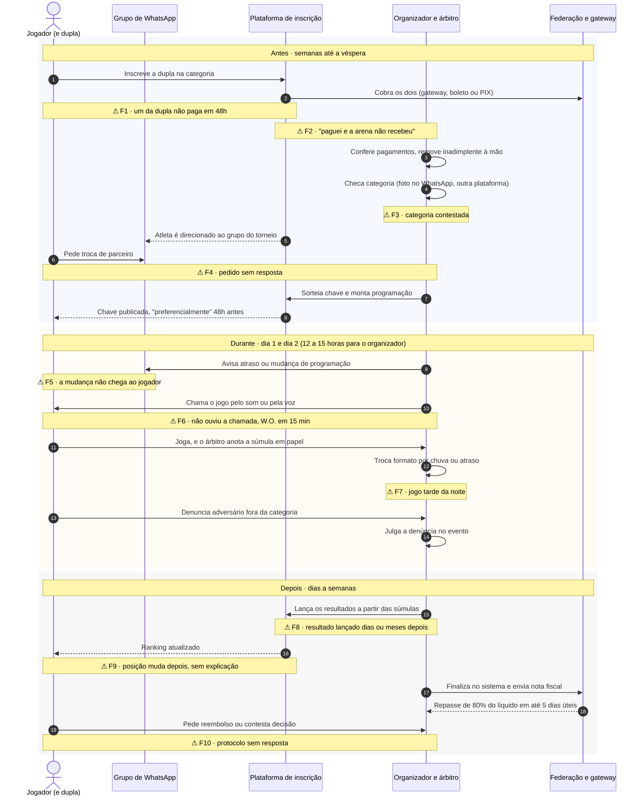
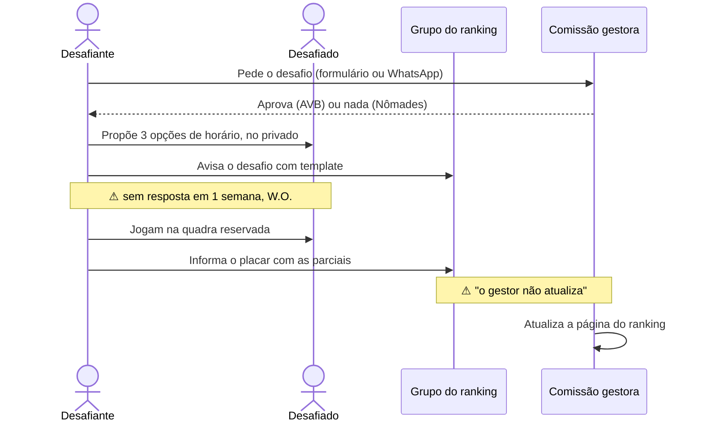

# 05 — Service blueprint de um fim de semana de torneio

Um torneio de fim de semana visto em camadas: o que o jogador faz e vê (**palco**), o que o organizador e o árbitro fazem por trás (**bastidores**), as ferramentas que sustentam tudo (**suporte**) e **onde quebra**. Liga a pesquisa do jogador à do organizador.

Técnica: *service blueprint*, de G. Lynn Shostack (1984), na forma difundida pelo Nielsen Norman Group. Códigos de fonte no [`README.md`](README.md).

> **Sem decisões de produto.** O blueprint descreve o serviço como ele acontece hoje, pela evidência. Não propõe como deveria ser.

---

## Como a técnica funciona

O *journey map* mostra a experiência de uma pessoa. O *blueprint* mostra **o serviço inteiro que produz essa experiência**, em faixas horizontais separadas por linhas:

| Faixa | O que mostra |
| --- | --- |
| **Evidência física** | O que o jogador vê ou toca: página do torneio, comprovante, mensagem no grupo, chave, placar |
| **Ações do jogador** | O que ele faz, passo a passo |
| — *linha de interação* — | Onde o jogador encontra o serviço |
| **Palco** (*frontstage*) | O que o organizador, o árbitro ou o app fazem **à vista** do jogador |
| — *linha de visibilidade* — | Tudo abaixo o jogador não vê |
| **Bastidores** (*backstage*) | O que o organizador e o árbitro fazem sem o jogador ver |
| — *linha de interação interna* — | |
| **Processos de suporte** | Ferramentas e terceiros: plataforma, gateway, WhatsApp, planilha, federação |

Os **pontos de falha** (⚠) marcam onde a evidência mostra o serviço quebrando.

**Analogia com design:** é a diferença entre a tela do Figma e o arquivo inteiro com as camadas abertas. O jogador vê a tela; o blueprint mostra as camadas escondidas que fazem a tela existir, e qual delas está sem nome, solta ou quebrada.

**O cenário:** um torneio amador de fim de semana, com chancela de federação estadual, 1 a 3 dias, em arena com 4 a 10 quadras. É o formato com mais evidência lida na íntegra (regulamento da FET, `JOR` REG1) e com mais voz de jogador. O ranking de arena (desafio) tem outro blueprint, mais simples, descrito no fim.

---

## Linha do tempo com as faixas

Quem faz o quê, em ordem. As notas com ⚠ são os pontos de falha, detalhados na tabela seguinte.

---

## O blueprint em faixas

Cada coluna é uma fase. As células vêm das fontes indicadas; o que é inferência está marcado.

| Faixa | 1 · Inscrição | 2 · Chave e véspera | 3 · Dia do torneio | 4 · Depois |
| --- | --- | --- | --- | --- |
| **Evidência física** | Página do torneio; regulamento em PDF; boleto ou comprovante de PIX (`DOR D2`) | Chave e programação publicadas; mensagem no grupo (`JOR` 1.1) | Som ou voz da mesa de arbitragem; kit e camiseta; frutas; transmissão no YouTube (`JOR` 1.2) | Resultado e ranking no app; e-mail de protocolo; troféu (`JOR` 1.3) |
| **Ações do jogador** | Escolhe categoria, acha parceiro, inscreve, paga, confere o pagamento do parceiro | Procura o horário do primeiro jogo; pede troca de parceiro se preciso | Chega, espera a chamada, joga, espera o próximo, denuncia se preciso | Confere resultado e posição; pede reembolso; contesta; se prepara para Finals |
| *linha de interação* | | | | |
| **Palco** | Plataforma confirma a inscrição quando os dois pagam (`DOR D2`) | Organizador publica a chave; responde (ou não) no grupo (`DOR D4`) | Mesa chama o jogo; árbitro aplica W.O.; organizador julga denúncia (`JOR` 1.2) | Plataforma mostra o resultado; organizador ou circuito responde protocolo (`DOR`, RA4) |
| *linha de visibilidade* | | | | |
| **Bastidores** | Confere pagamentos; remove inadimplente à mão; verifica categoria com foto e outra plataforma; dimensiona quadras e equipe (`JOR` 1.1; `DOR D1`, `D2`) | Sorteia chave com cabeças de chave; monta programação; descobre tamanho de camisa no WhatsApp (`JOR` 1.1) | Monta quadras e kits; compra frutas; troca formato por clima; anota súmula em papel (`JOR` 1.2) | Lança resultado das súmulas; finaliza no sistema; emite nota fiscal; decide reembolso e impugnação (`JOR` 1.3) |
| *linha de interação interna* | | | | |
| **Suporte** | Plataforma de inscrição (LetzPlay, Tênis Integrado, app de circuito); gateway, boleto, PIX na chave do organizador; federação homologa (`APR`, achado 2) | Plataforma gera a chave; grupo de WhatsApp; planilha para formatos que a plataforma não cobre (`DOR D9`) | Sistema de som; rádio comunicador; WhatsApp; formulário de denúncia (`JOR` 1.2) | Plataforma; federação (repasse de 80%, multa se não divulgar patrocinador); Reclame Aqui como canal de fato (`JOR` 1.3) |
| **Pontos de falha** | F1, F2, F3 | F4 | F5, F6, F7 | F8, F9, F10 |

---

## Pontos de falha

Ordenados pela fase. "Custo para o jogador" é o que a evidência mostra acontecendo quando a falha ocorre.

| # | Falha | Faixa onde nasce | Custo para o jogador | Evidência | Força |
| --- | --- | --- | --- | --- | --- |
| F1 | Um da dupla não paga no prazo | Suporte (dois pagamentos) | Inscrição cancelada; "deverá ser refeita pelos atletas sob suas inteiras responsabilidades" | `DOR D2` (REG1, RA3) | Forte |
| F2 | Pagamento feito e não reconhecido | Suporte (gateway × PIX × comprovante) | Cobrança indevida; "Fiz o pagamento pelo App e a Arena não recebeu!" | `DOR D2` | Forte |
| F3 | Categoria contestada, antes ou depois | Bastidores (checagem manual) | Jogo desequilibrado; desclassificação ("mais de 25 pessoas"); vaga em Finals perdida; processo | `DOR D1` | Forte |
| F4 | Pedido de troca de parceiro sem resposta | Palco (WhatsApp, e-mail) | Duas semanas sem resposta a 5 dias do torneio | `DOR D3` (RA6) | Forte |
| F5 | Mudança de programação que não chega | Suporte (grupo, e-mail) | W.O., jogo perdido | `MER O3`; `DOR D4` | Forte |
| F6 | Chamada por som não ouvida | Palco (som, voz) | W.O. em 15 min, mantido mesmo "que haja comum acordo" | `JOR` 1.2 (REG1); `MER O3` | Forte |
| F7 | Atraso e clima empurram jogos para a noite | Bastidores (programação) | Jogo tarde da noite; formato trocado no meio | `JOR` 1.2 | Forte (regra); inferência (frequência) |
| F8 | Resultado lançado tarde | Bastidores (súmula em papel → sistema) | Ranking parado; histórico incompleto; "2 meses e os jogos ainda estão pendentes" | `DOR D6`; `MER O1` | Forte (consequência); Fraca (causa) |
| F9 | Posição muda depois do evento, sem explicação | Bastidores (impugnação, desclassificação, bônus) | Não entende a conta; perde vaga sem saber por quê | `ORG`, O4; `APR`, O4 | Média |
| F10 | Protocolo sem resposta | Palco (canal de suporte) | "Cinco protocolos sem resposta em 7 dias"; o jogador vai ao Reclame Aqui ou à Justiça | `DOR D1`, `D4` (RA4) | Média |

Um ponto de falha **transversal**, que atravessa as quatro fases: **não há responsável visível**. "Não havia nenhum responsável pelo evento no local" (`JOR` 1.2, RA3, relato único). E, fora do local, a cadeia de responsabilidade devolve a questão ao jogador (`DOR`, "a cadeia de responsabilidade").

---

## O que o blueprint mostra (leitura descritiva)

- **Quase todas as falhas nascem abaixo da linha de visibilidade.** O jogador sente F5, F6 e F8 no palco, mas a causa está nos bastidores (súmula em papel, programação refeita) ou no suporte (grupo, som). Um app do jogador enxerga o sintoma, não a causa.
- **O WhatsApp aparece em três faixas ao mesmo tempo:** evidência física (a mensagem), palco (o organizador responde) e suporte (o canal). É por isso que ele é tão difícil de substituir (`S22`).
- **O dinheiro puxa o organizador a finalizar; o jogador, não.** O repasse só sai depois de finalizar no sistema (`JOR` 1.3). É o único incentivo formal observado para lançar resultado, e existe só no torneio federado.
- **As três fases com mais falhas são as que o `docs/PRODUCT.md` deixa fora do MVP** (inscrição e pagamento, visão do organizador) ou que dependem delas (horário, resultado).

---

## Variação: ranking de arena (escada de desafio)

Mais simples, contínuo e com outro dono do resultado. Resumo a partir do `JOR` 2 (dois regulamentos lidos na íntegra).

**A diferença que importa:** no torneio, quem lança é o árbitro ou o organizador; no ranking de arena, o jogador informa e a comissão aprova. A falha F8 existe nos dois, mas por motivos diferentes (súmula no torneio; gestor que não atualiza no ranking). Isso liga o blueprint à pergunta aberta 1 do `README.md`.

---

## Limites

- **É o blueprint de um torneio federado estadual**, o de regra mais completa. O torneio amador de arena sem chancela tem menos passos no suporte (sem federação, sem repasse) e provavelmente mais WhatsApp. É inferência.
- **Nenhum organizador foi entrevistado nem observado.** Os bastidores vêm de regulamento, de um vídeo de organizadoras e de respostas no Reclame Aqui. A observação num torneio (*contextual inquiry*) do [`08-plano-validacao.md`](08-plano-validacao.md) é a forma de conferir este blueprint.
- **Tempos por etapa não foram medidos.** O único número é o dia de 12 a 15 horas das organizadoras do vídeo (`JOR`).
