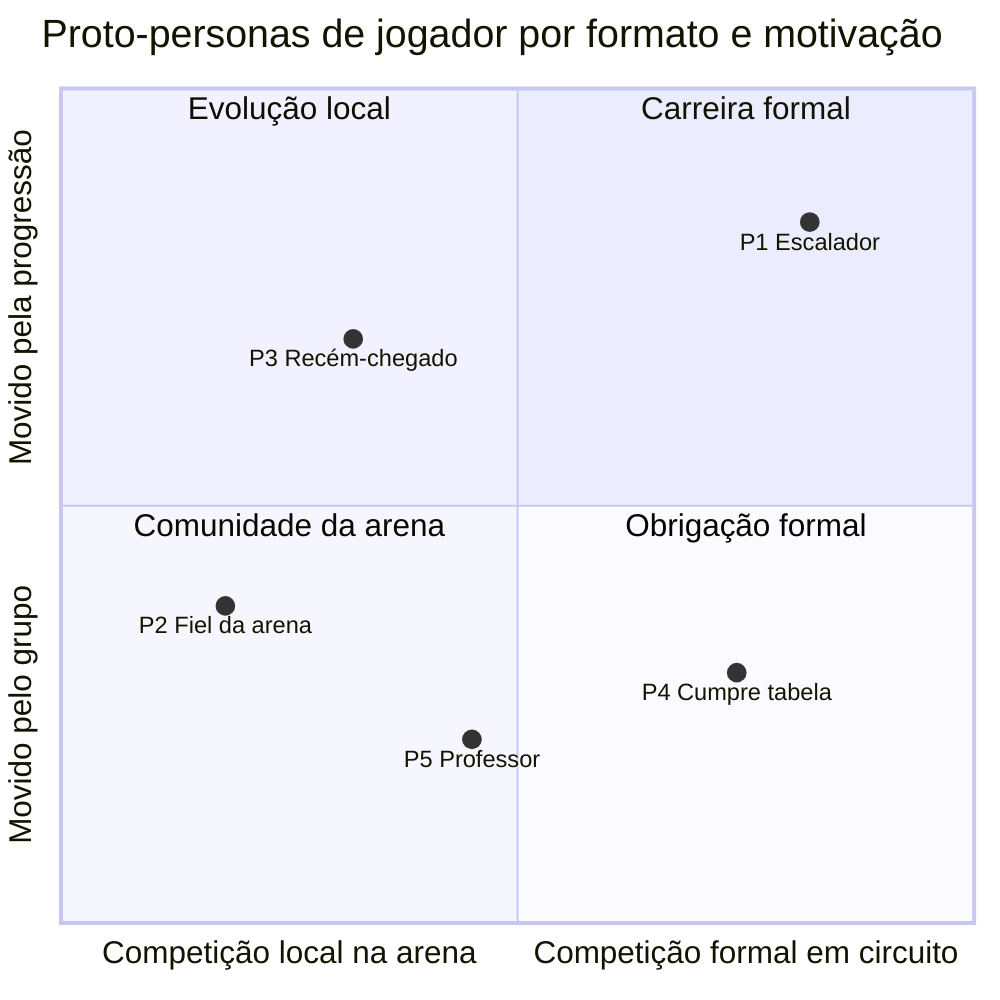

# 06 — Proto-personas comportamentais

Arquétipos definidos por **comportamento e motivação**, não por idade, gênero ou renda. Cada um carrega a evidência que o sustenta e o que ainda precisa ser validado com pessoas reais.

Técnica: *proto-persona*, na forma de Jeff Gothelf (*Lean UX*, 2013), com o recorte comportamental de Indi Young (*Describing Personas*, 2016). Códigos de fonte no [`README.md`](README.md).

> **Sem decisões de produto.** As personas não dizem para quem o LetzPlay é. Dizem que comportamentos aparecem na evidência. Escolher o público do beta é decisão do Gabriel (`MER`, pergunta 2).

---

## Como a técnica funciona

Uma **persona** clássica nasce de pesquisa com pessoas. Uma **proto-persona** é o passo anterior: a melhor hipótese do time sobre quem são os usuários, escrita de forma explícita **para ser testada**. Gothelf a usa para alinhar o time antes da pesquisa, sabendo que ela vai mudar.

Duas escolhas deste arquivo:

- **Comportamento, não demografia.** Indi Young mostra que "mulher, 35 anos, classe A" não prevê o que alguém faz num app; "joga ranking de arena e combina tudo no grupo" prevê. A demografia do público está no `PUB` (hipóteses HP1 e HP2) e não entra aqui.
- **Nomes funcionais, não nomes próprios.** "O escalador de categoria" em vez de "Ana, 34". Evita que o time trate a hipótese como uma pessoa real, e evita atribuir gênero a um arquétipo.

**Analogia com design:** a proto-persona é o *wireframe* da persona. Tem a estrutura e as caixas certas, mas ninguém confunde com a tela final.

**Um jogador real pode ser mais de uma persona** ao longo do ano, ou até no mesmo fim de semana. As personas descrevem modos de agir, não tipos de gente.

---

## O mapa das personas de jogador

Dois eixos que a evidência separa bem: **onde** a pessoa compete e **o que a move**.

As posições são hipótese. A persona de organizador (P6) não entra no gráfico porque os eixos são do jogador.

---

## P1 · O escalador de categoria

> "Eu jogo para subir. Cada torneio é ponto, e cada ponto conta para a Finals e para a próxima categoria."

| | |
| --- | --- |
| **Comportamento-chave** | Joga circuito ou federação na maioria das semanas de temporada; acompanha a própria posição e a linha de corte; pesquisa o adversário |
| **Motivação** | Progressão: subir de categoria, chegar às Finals, ver o esforço virar número |
| **Formato** | Torneio federado ou de circuito, muitas vezes mais de um ranking ao mesmo tempo |
| **Etapas do job em que mais dói** | 4 · confirmar, 5 · executar, 6 · monitorar, 8 · concluir ([`04`](04-mapa-do-job.md)) |
| **Forças dominantes** | Empurrão: resultado pendente e horário perdido. Hábito: o ranking oficial está no app da federação ([`03`](03-forcas-progresso.md)) |

**Evidência que sustenta:**

| Evidência | Fonte | Força |
| --- | --- | --- |
| Ranking estadual conta as 7 melhores pontuações do ano; promoção formal por posição | `PUB` 2.1, 2.2 (FCTBT, CBT) | Forte (regra) |
| Joga 3 a 4 vezes por semana; amadores com "equipe multidisciplinar" | `PUB HP4`; `PUB` 2.2 | Fraca a Média |
| W.O. em quartas de Brasileiro; "Não lançaram meu 3º lugar" | `MER O1`, `O3` | Forte |
| Impugnação levada à Justiça para não perder a vaga nas Finals | `DOR D1` (RA4) | Média |
| "Stuck at 2.5 DUPR … Now Playing at 4.0" | `MER O9` (fora do BT) | Fraca |

**O que precisa validar:** se subir e descer de fato mexe com a pessoa (`S5`, `S15`); quantos torneios ela joga por ano (lacuna em `PUB`); se ela consulta o adversário antes do jogo (`S7`).

**Como reconhecer no Tally:** "Nos últimos 12 meses, jogou ranking ou torneio?" = torneios; "Quantos torneios?" = 4 a 10 ou mais; confere a posição várias vezes por semana ou depois de cada jogo.

---

## P2 · O fiel do ranking da arena

> "O ranking é da minha arena. A gente combina no grupo, joga, posta o placar. É competição, mas é com a turma."

| | |
| --- | --- |
| **Comportamento-chave** | Disputa a escada de desafio da arena onde tem aula; combina data e quadra no WhatsApp; tem dupla principal |
| **Motivação** | Pertencimento com competição: jogar com a turma, e ter um motivo para jogar |
| **Formato** | Ranking de arena (desafio), às vezes somado aos torneios da casa |
| **Etapas do job em que mais dói** | 4 · confirmar (marcar o jogo), 6 · monitorar (o gestor não atualiza) |
| **Forças dominantes** | Hábito: o grupo de WhatsApp já resolve. Empurrão: "2 meses e os jogos ainda estão pendentes" |

**Evidência que sustenta:**

| Evidência | Fonte | Força |
| --- | --- | --- |
| Regulamentos de escada de desafio com template de aviso no grupo e placar informado pelo jogador | `JOR` 2 (REG2, REG3) | Forte (regra) |
| Mais de 3/4 preferem jogar em arena; prefere jogar com amigos; mora perto | `PUB` 2.3 | Média |
| "quase 80 pessoas em nosso ranking" no 3º mês de um app | `DOR D7` (AS1) | Média |
| O professor e a arena são a porta de entrada e o centro social | `PUB HP8` | Média |
| "2 meses e os jogos ainda estão pendentes" porque "o gestor não atualiza" | `MER O1`; `JOR` 2 | Forte |

**O que precisa validar:** se aceita registrar no app o que combina no grupo (`S2`, a suposição mais arriscada para esta persona); se o ranking é o motivo de abrir o app ou o grupo basta (`S1`); se o feed de amigos tem valor aqui, onde a turma já se vê todo dia (`S10`).

**Como reconhecer no Tally:** "Só rankings" ou "rankings e torneios"; marca jogos "direto com os adversários (ex.: WhatsApp)"; usa "Grupos de WhatsApp"; tem "uma dupla principal".

---

## P3 · O recém-chegado competitivo

> "Comecei faz pouco tempo e já estou jogando torneio. Não sei direito se estou na categoria certa nem onde tem competição para mim."

| | |
| --- | --- |
| **Comportamento-chave** | Joga a categoria mais baixa (D ou iniciante); experimenta os primeiros torneios; procura competição e dupla |
| **Motivação** | Competência: testar o próprio nível, evoluir rápido, não passar vergonha |
| **Formato** | Torneios amadores de arena, rankings abertos a iniciantes |
| **Etapas do job em que mais dói** | 1 · definir (qual categoria), 2 · localizar (onde tem competição), 3 · preparar (achar dupla) |
| **Forças dominantes** | Atração: "achar jogo, torneio e gente do mesmo nível". Ansiedade: não estar no nível |

**Evidência que sustenta:**

| Evidência | Fonte | Força |
| --- | --- | --- |
| 44,8% dos que competem em Criciúma jogam a categoria D; 48% jogavam havia 1 a 3 meses | `PUB` 2.1 | Média (estudo local) |
| 70% começaram durante ou no fim da pandemia; 60% já praticavam outro esporte | `PUB HP6` | Média |
| Motivações centrais: competência, diversão, saúde e socialização | `PUB` 1.2 | Fraca |
| Nomenclatura de categorias sem padrão; a pessoa não sabe onde se encaixa | `DSC` 1.3 | Média (fato); Fraca (dor) |
| Filtros de nível e região: 9 menções em 5 apps | `MER O8` | Média (fora do BT) |

**O que precisa validar:** se o recém-chegado compete a ponto de ser público do produto, ou se é o "jogador por diversão" que o `CLAUDE.md` exclui ("quem não compete não tem motivo para usá-lo"); se descobrir competição é dor real para ele (`S14`); se o valor está na evolução (`S24`).

**Como reconhecer no Tally:** joga há menos de 1 ano; categoria Iniciante ou D; no bloco "O que te afasta", marca "Ainda não me sinto no nível" ou "Não sei onde encontrar competições".

---

## P4 · Quem cumpre tabela

> "Uso o app porque a federação exige. Entro para ver meu horário e meu resultado, e saio."

| | |
| --- | --- |
| **Comportamento-chave** | Usa o app que a federação, o circuito ou a arena escolheu; faz a tarefa mínima (inscrição, horário, resultado) e sai |
| **Motivação** | Competir; o app é custo, não parte da experiência |
| **Formato** | Qualquer um, mas típico do federado |
| **Etapas do job em que mais dói** | 3 · preparar (inscrição e pagamento), 4 · confirmar, 6 · monitorar |
| **Forças dominantes** | Hábito imposto: não escolheu o app. Empurrão: navegação e sessão |

**Evidência que sustenta:**

| Evidência | Fonte | Força |
| --- | --- | --- |
| 4 reviews em 3 apps dizem que usam o app porque a federação, o clube ou o circuito exige | `MER O5`, `RS4` | Forte |
| Navegação é a dor mais citada: 15 menções em 5 apps; "Mais que 3 cliques pra ver informação simples" | `MER O6` | Forte |
| Conta e login: 8 menções; "não reconhece meu login … no meio do torneio" | `MER O7` | Forte |
| O organizador federado também não escolhe a ferramenta | `ORG RO2` | Forte |

**O que precisa validar:** quanto do público é esta persona (`S13`); se, para ela, confiabilidade basta e o resto é indiferente (o que a hipótese de Kano chama de "obrigatório", [`07`](07-kano.md)).

**Como reconhecer no Tally:** marca "App ou site do ranking/circuito que eu jogo"; a última vez que abriu o app foi para "Me inscrever" ou "Ver o resultado de um jogo"; confere a posição "Raramente ou nunca".

---

## P5 · O professor-organizador

> "Eu dou aula, jogo e organizo o torneio da arena. Meus alunos jogam o ranking que eu monto."

| | |
| --- | --- |
| **Comportamento-chave** | Dá aula, compete (como vitrine da arena) e organiza torneios e rankings da casa; é o elo entre jogador, arena e organizador |
| **Motivação** | Negócio e vínculo: encher turma, fidelizar aluno, levar o aluno a competir |
| **Formato** | Torneio e ranking de arena |
| **Etapas do job em que mais dói** | Como jogador, as mesmas de P2. Como organizador, o dia do torneio e a cauda do depois (`JOR`) |
| **Forças dominantes** | Empurrão: dia de 12 a 15 horas. Hábito: o WhatsApp com os alunos |

**Evidência que sustenta:**

| Evidência | Fonte | Força |
| --- | --- | --- |
| Dupla de organizadoras que também dão aula: "a gente organiza torneio dá aula toma cerveja faz churrasco" | `JOR` 3 (YT1) | Média (um vídeo) |
| Arena fecha parceria com professor "com experiência em promover campeonatos" para fidelizar | `ARE` 3 (ACAD1) | Média |
| Professores que competem são estratégia de marketing da arena | `ARE` 3 (ACAD2) | Média |
| 3/4 dos jogadores de um evento já contrataram professor | `PUB` 5.3 | Média |
| O professor é "peça central e disputada" entre arenas | `ARE`, resumo | Média |

**O que precisa validar:** se é um público à parte ou um organizador que também joga (`ORG`, pergunta 6); quanto do ranking de arena passa pela mão dele. Nenhum JTBD do `CLAUDE.md` o descreve.

**Como reconhecer no Tally:** não há pergunta que o identifique hoje. A proposta do [`09`](09-proposta-tally.md) sugere uma.

---

## P6 · Quem organiza a etapa

> "Chego antes de todo mundo e saio depois. No meio, é categoria, pagamento, W.O. e WhatsApp."

Persona de organizador, incluída porque o blueprint e as forças dependem dela, mesmo com a visão do organizador fora do MVP.

| | |
| --- | --- |
| **Comportamento-chave** | Opera o torneio de ponta a ponta: inscrição, categoria, chave, dia do torneio, resultado, repasse; responde tudo pelo WhatsApp |
| **Motivação** | Fazer o evento acontecer sem prejuízo e sem conflito; manter a chancela |
| **Formato** | Etapa federada ou circuito; às vezes arena |
| **Dores dominantes** | Categoria contestada, pagamento por dupla, mudança de última hora, WhatsApp que não escala, dia do torneio (`ORG`, as 5 mais fortes) |
| **Forças dominantes** | Empurrão forte; hábito e ansiedade institucionais (chancela, repasse) ([`03`](03-forcas-progresso.md)) |

**Evidência que sustenta:** `DOR D1` a `D9`; `JOR` 1 e 3. É a persona com mais fonte em primeira pessoa do discovery (vídeos de organizadoras, diretor de federação), mas **nenhuma entrevista**.

**O que precisa validar:** por que o resultado atrasa (`S3`, causa Fraca); se o organizador pequeno de arena e o de etapa federada são a mesma persona (`DOR`, ressalva sobre a voz de circuitos grandes). O roteiro pronto está no `RTE`.

---

## Personas lado a lado

| | P1 Escalador | P2 Fiel da arena | P3 Recém-chegado | P4 Cumpre tabela | P5 Professor | P6 Organizador |
| --- | --- | --- | --- | --- | --- | --- |
| JTBD mais forte | 2, 5 | 2, 4 | 1, 5 | 2 | 1 (dos alunos) | — |
| Onde a evidência é mais forte | Regra e voz | Regra | Estudo local | Voz | Acadêmico e vídeo | Primeira pessoa e regra |
| Suposição mais arriscada | `S5` | `S2` | `S14` | `S13` | — | `S3` |
| Força da persona | Média | Média | Fraca a Média | Forte | Média | Média |

**"Força da persona"** é a força da evidência de que o **comportamento** existe, não de que a persona é grande ou importante. P4 é a mais forte porque várias reviews independentes descrevem exatamente esse comportamento.

---

## Limites

- **Nenhuma persona foi conversada.** As citações no topo de cada uma são sínteses do agente em linguagem de jogador, não falas reais. As falas reais estão nas tabelas de evidência.
- **As personas de jogador vêm de fontes diferentes com vieses diferentes:** P1 e P4 de reviews (viés negativo), P2 de regulamento (a regra, não a prática), P3 de estudos locais pequenos.
- **Faltam personas que a evidência sugere mas não sustenta:** o dono de arena que não organiza (só aluga quadra) e o jogador de simples. Ficaram de fora por falta de fonte.
