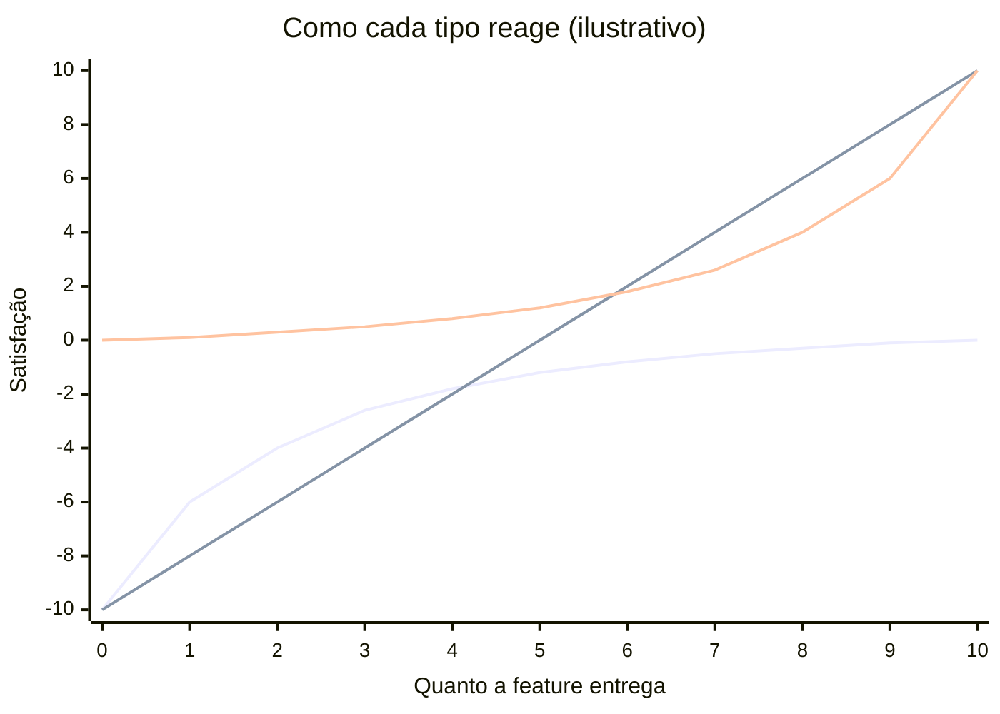
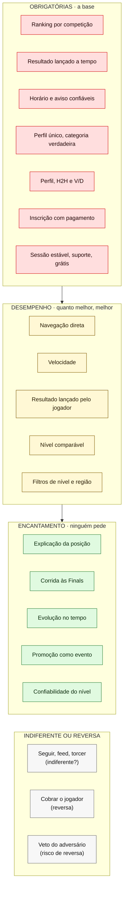

# 07 — Hipótese de Kano

As features da matriz de concorrentes classificadas pelo **efeito que teriam na satisfação do jogador**: obrigatórias (*table stakes*), de desempenho e de encantamento. **É hipótese**, feita a partir da oferta e das reviews, para ser testada com o questionário de Kano proposto no [`09-proposta-tally.md`](09-proposta-tally.md).

Técnica: modelo de Kano, de Noriaki Kano (1984). Features da [`MATRIZ_FEATURES.md`](../MATRIZ_FEATURES.md). Códigos de fonte no [`README.md`](README.md).

> **Sem decisões de produto.** Uma feature obrigatória não precisa estar no MVP, e uma de encantamento pode ser a aposta certa. A classificação diz como a satisfação reage, não o que construir.

---

## Como a técnica funciona

Kano observou que nem toda feature mexe com a satisfação do mesmo jeito. Ele separou cinco tipos:

| Tipo | Se está ausente ou ruim | Se está presente e boa | Exemplo fora do BT |
| --- | --- | --- | --- |
| **Obrigatória** (*must-be*) | Insatisfação forte | Ninguém agradece: é o mínimo | Freio do carro |
| **Desempenho** (*one-dimensional*) | Insatisfação proporcional | Satisfação proporcional: quanto melhor, melhor | Consumo de combustível |
| **Encantamento** (*attractive*) | Ninguém sente falta | Surpresa e satisfação | O primeiro carro com câmera de ré |
| **Indiferente** | Ninguém sente falta | Ninguém liga | A cor do motor |
| **Reversa** | Uma parte do público prefere sem | Irrita uma parte do público | Som alto de alerta que não desliga |

O gráfico clássico, com a satisfação no eixo vertical e o quanto a feature entrega no horizontal:

A curva de baixo é a **obrigatória** (no máximo chega a zero), a reta é a de **desempenho**, e a de cima é a de **encantamento** (nunca cai abaixo de zero).

**Duas propriedades que importam aqui:**

- **As features envelhecem.** O que encanta hoje vira desempenho amanhã e obrigatório depois. A câmera de ré foi encantamento e hoje é obrigatória. No BT, o H2H provavelmente já fez esse caminho.
- **A classificação depende de quem responde.** O mesmo recurso pode ser obrigatório para quem usa o app porque a federação exige (P4 do [`06`](06-proto-personas.md)) e de desempenho para quem escolheu o app.

**Analogia com design:** a pirâmide de necessidades de UX (funcional, confiável, usável, agradável). As obrigatórias moram na base; o encantamento, no topo. Encantamento em cima de uma base quebrada não compensa.

---

## Como a hipótese foi feita

Kano classifica com um questionário (seção final e [`09`](09-proposta-tally.md)). Sem respostas, a hipótese usa sinais da evidência como indício de cada tipo:

| Sinal na evidência | Tipo sugerido |
| --- | --- |
| Quase todos os concorrentes têm (table stakes no `MAT`) **e** há queixa forte quando falha | Obrigatória |
| A voz pede **mais** ou **melhor** em grau (mais rápido, mais confiável, menos toques) | Desempenho |
| Poucos oferecem, ninguém pede, e quem tem é elogiado ou cobra por isso | Encantamento |
| Oferta abundante, demanda nula na amostra | Indiferente |
| Uma parte do público reclama da presença | Reversa |

A coluna **Confiança** diz quão bem os sinais sustentam a classificação: Média quando dois sinais concordam, Fraca quando há um só ou quando os sinais vêm de fora do BT.

---

## A hipótese, por JTBD

### JTBD 1 — Encontrar competição

| Feature | Tipo | Sinal | Confiança |
| --- | --- | --- | --- |
| Lista ou busca de torneios | Obrigatória | Todos os apps de BT têm (`MAT`) | Média |
| Inscrição com pagamento online | Obrigatória | Table stakes; queixa forte quando a cobrança falha (`DOR D2`) | Média |
| Notificação de chave, horário e mudança | Obrigatória | Falha custa W.O. e "perdemos torneios"; quando funciona, ninguém elogia (`MER O3`) | Média |
| Filtro por nível e região | Desempenho | "Filtros ruins" em 9 menções: a queixa é de grau (`MER O8`) | Fraca (fora do BT) |
| Programação ao vivo no dia | Desempenho | O WhatsApp faz; quanto mais atual, melhor (`MAT`) | Fraca |
| Agenda dos meus eventos inscritos | Desempenho | Parcial em quase todos; sem voz | Fraca |
| Achar parceiro ou adversário por nível | Encantamento | Ninguém no BT oferece bem; elogio fora do BT (`MER O8`) | Fraca |

### JTBD 2 — Saber onde estou no ranking

| Feature | Tipo | Sinal | Confiança |
| --- | --- | --- | --- |
| Ranking por competição | Obrigatória | Todos têm; é a razão de estar no app (`MAT`, `DSC` 4.2) | Média |
| Resultado de torneio lançado a tempo | Obrigatória | "2 meses e os jogos ainda estão pendentes"; ninguém elogia quando chega (`MER O1`) | Média |
| Jogador lança o resultado | Desempenho | Quanto mais rápido entra, melhor (`MER O1`) | Fraca |
| Adversário confirma, com prazo | Desempenho, com risco de **Reversa** | Acelera o resultado, mas o veto do perdedor irrita (8 threads, `VZA`) | Fraca |
| Explicação de por que a posição mudou | Encantamento | Ninguém mostra a conta; a queixa vem de apps de rating (`MAT L5`) | Fraca |
| Corrida às Finals com linha de corte | Encantamento | Só o Ranketes declara; nenhuma review pede (`MAT`) | Fraca |
| Aviso de mudança de posição | Encantamento | Quase ninguém tem; nenhuma voz (`MAT`) | Fraca |
| Rating que atravessa competições | Encantamento, com risco de **Reversa** | Pedido explícito único; "such a lie" contra ratings (`MER O10`, `RAT`) | Fraca |

### JTBD 3 — Preparar-me para um confronto

| Feature | Tipo | Sinal | Confiança |
| --- | --- | --- | --- |
| Perfil público com histórico | Obrigatória | Todos têm (`MAT`) | Média |
| H2H entre jogadores | Obrigatória | Table stakes no BT (LetzPlay, Meu Ranking, Ranketes) (`MER`, abaixo do corte) | Média |
| Perfil único e categoria verdadeira | Obrigatória | *Sandbagging* é queixa forte dos dois lados; ninguém elogia a ausência de fraude (`DOR D1`) | Média |
| Nível comparável entre adversários | Desempenho | "Rating que não reflete o nível": queixa de grau (`MER O2`) | Fraca (fora do BT) |
| Confiabilidade do nível (verificado, peso por origem) | Encantamento | Só UTR e DUPR; nenhum app de BT (`MAT L3`) | Fraca |
| Adversários em comum, ranking na data do jogo | Encantamento | Quase ninguém tem; sem voz (`DSC` 3.3) | Fraca |
| Histórico de W.O. do adversário | Encantamento | Um pedido em review (Playtomic) (`MAT`) | Fraca |

### JTBD 4 — Acompanhar amigos no BT

| Feature | Tipo | Sinal | Confiança |
| --- | --- | --- | --- |
| Seguir jogadores | Indiferente | Oferta abundante, demanda quase nula (`MAT`, padrões) | Fraca |
| Feed de atividade automático | Indiferente | Idem; 1 elogio e 1 queixa na amostra (`MER`, abaixo do corte) | Fraca |
| Torcer, curtir, comentar | Indiferente | Idem | Fraca |
| Gestão de parceiros frequentes | Desempenho | "não dá para remover" (LetzPlay): queixa de grau (`MAT`) | Fraca |

**Ressalva forte para este JTBD:** ausência de voz em review não prova indiferença. Reviews negativas falam do que quebrou, e ninguém escreve "adoro o feed" com a mesma frequência. É o JTBD em que a hipótese de Kano é mais frágil e o questionário mais útil (`S10`).

### JTBD 5 — Sentir que estou evoluindo

| Feature | Tipo | Sinal | Confiança |
| --- | --- | --- | --- |
| Estatística de vitória e derrota | Obrigatória | Table stakes; "esvaziada por pendentes" quando falha (`MAT`) | Média |
| Gráfico de evolução no tempo | Encantamento | Os concorrentes cobram por ele: o mercado trata como extra (`MAT L9`) | Fraca |
| Promoção de categoria como evento | Encantamento | Regra formal, ninguém celebra na tela (`MAT L11`) | Fraca |
| Marcos e badges | Encantamento | Só o Ranketes (selo top 10) | Fraca |
| Retrospectiva do ano | Encantamento | Nenhum app de raquete; Strava cobra (`MAT L12`) | Fraca |

### Fundação (vale para todos os JTBDs)

| Feature | Tipo | Sinal | Confiança |
| --- | --- | --- | --- |
| Sessão e login estáveis | Obrigatória | "deslogar ... depois de poucos minutos"; correções recorrentes desde 2022 (`MER O7`, `APR`) | Média |
| Suporte que responde | Obrigatória | 9 menções em 5 apps; protocolos sem resposta (`MER O7`, `DOR D4`) | Média |
| App gratuito para o jogador | Obrigatória | Nenhum app de BT cobra o jogador (`MAT`, table stakes) | Média |
| Navegação direta para a tarefa do dia | Desempenho | A dor mais citada, sempre em grau ("mais que 3 cliques") (`MER O6`) | Média |
| Velocidade do app | Desempenho | Lentidão: 13 menções (`MER O7`) | Média |
| Taxa ou assinatura cobrada do jogador | **Reversa** | MATCHi: 5 das 10 reviews visíveis reclamam; o Ranketes tenta com uso quase nulo (`VZA`, `TDN`) | Média (fora do BT) |

---

## A hipótese num quadro só

As setas indicam a ordem de leitura da pirâmide: o encantamento só aparece se a base estiver de pé.

---

## O que a hipótese mostra (leitura descritiva)

- **As obrigatórias são as que o LetzPlay atual declara e que falham.** A matriz já mostrava que as queixas são de confiabilidade, não de ausência (`MAT`, padrões; `S9`). No vocabulário de Kano: o incumbente tem as obrigatórias no papel, e a falha delas gera a insatisfação que aparece nas lojas.
- **Quase todo o encantamento está no JTBD 5 e na explicação do ranking.** São as features que os concorrentes de fora do BT cobram, e que ninguém no BT pediu. É onde a hipótese mais precisa do questionário.
- **Duas features têm risco de Reversa que a matriz não mostrava:** a confirmação pelo adversário (o veto) e o rating transversal (o número que "mente"). Ambas são soluções vistas para oportunidades fortes (`B1`, `C3` do [`02`](02-arvore-oportunidades.md)).
- **O JTBD 4 aparece como indiferente**, mas é o dado mais frágil da tabela.

---

## Limites

- **Não é Kano: é uma hipótese de Kano.** O modelo exige perguntar a cada respondente o par funcional/disfuncional ("como você se sente se tiver X? e se não tiver?"). Aqui não houve respondente.
- **Reviews têm viés para o obrigatório.** As pessoas escrevem quando algo quebra. Isso empurra a classificação para "obrigatória" e esconde o encantamento.
- **A classificação é do jogador.** O organizador teria outra tabela (inscrição por dupla, por exemplo, provavelmente é obrigatória para ele e indiferente para o jogador até falhar).
