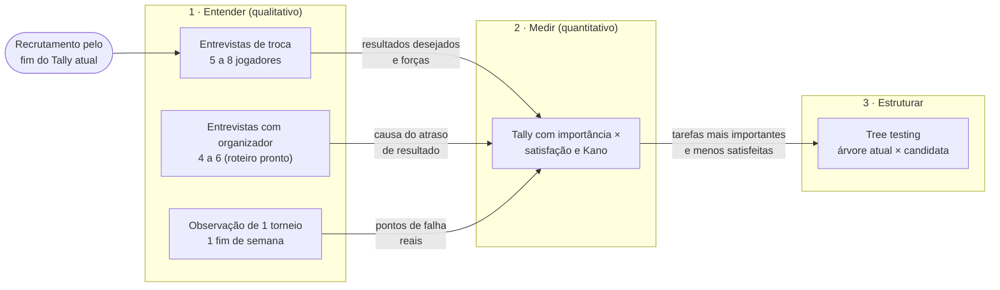

# 08 — Plano de validação

Para as suposições mais arriscadas do [`01-mapa-suposicoes.md`](01-mapa-suposicoes.md): **qual método usar com pessoas reais, com quem, e o que perguntar**. Quatro métodos: entrevista de troca, observação num torneio, pontuação de oportunidade com Kano no Tally, e *tree testing* da navegação.

Códigos de fonte no [`README.md`](README.md).

> **Sem decisões de produto.** O plano é um cardápio ordenado pelo risco. Quantas conversas fazer, com quem e quando é decisão do Gabriel (perguntas 5 e 6 do `README.md`). Os critérios de "confirma" e "derruba" são **propostas** para discutir antes de ir a campo, não metas.

---

## Por que esses quatro métodos

Cada suposição pede um tipo de evidência. O erro comum é usar um questionário para tudo.

| Pergunta que a suposição faz | Tipo de evidência | Método |
| --- | --- | --- |
| **Por que** a pessoa age assim? O que a faria trocar? | Qualitativa, sobre o passado real | Entrevista de troca (JTBD *switch interview*) |
| **O que de fato acontece** no serviço, e onde quebra? | Observação do comportamento | Observação num torneio (*contextual inquiry*) |
| **Quanto** isso importa, para **quantas** pessoas? | Quantitativa, declarada | Pontuação de oportunidade e Kano no Tally |
| As pessoas **acham** o que procuram na estrutura do app? | Comportamento numa tarefa | *Tree testing* |

**A regra de ouro das duas primeiras:** perguntar sobre o que a pessoa **fez**, nunca sobre o que ela **faria**. "Você usaria um app que…?" produz educação, não dado. "Me conta da última vez que…" produz história. (Rob Fitzpatrick, *The Mom Test*, 2013.)

**Analogia com design:** é o mesmo cuidado do teste de usabilidade. Você não pergunta "você acha esse botão claro?"; você pede a tarefa e observa onde a pessoa clica.

---

## A sequência sugerida

Cada etapa alimenta a seguinte. O Tally vem **depois** das entrevistas porque elas dão a lista de resultados desejados a medir.

**Recrutamento:** o rascunho do Tally já termina com "Topa uma conversa de 20 minutos?". Se o formulário for publicado antes, ele recruta para as entrevistas. É a alternativa de ordem que a pergunta 6 do `README.md` pede para decidir.

---

## Cartões de teste por suposição

No formato do *Test Card* de David Bland: **acreditamos que** (suposição) → **para verificar, vamos** (método) → **e medir** (o quê) → **estamos certos se** (critério). Ordenados pelo risco do mapa.

### S3 · Alguém lança o resultado a tempo sem o app controlar a operação

| | |
| --- | --- |
| **Acreditamos que** | O jogador (no ranking de arena) e o organizador (no torneio) lançam o resultado a tempo, se a ferramenta facilitar |
| **Para verificar, vamos** | Entrevistar 4 a 6 organizadores com o `RTE` (seção 2, "o último torneio") e observar a cauda do depois num torneio |
| **E medir** | A causa do atraso em cada caso: falta de tempo, súmula em papel, disputa de placar, ferramenta difícil, outra |
| **Estamos certos se** *(proposta)* | A maioria dos atrasos relatados vem de atrito de ferramenta ou de tempo (algo que o app muda), e não de disputa ou de desinteresse |
| **O que perguntar** | "Me conta do último torneio: da última partida até o resultado aparecer no sistema, o que aconteceu, passo a passo?" · "Teve algum resultado que demorou mais? Por quê?" · "Quem cobrou você por isso? Como?" |

### S2 · O jogador aceita registrar no app o jogo que combinou no WhatsApp

| | |
| --- | --- |
| **Acreditamos que** | O jogador de ranking de arena registraria e confirmaria no app o jogo que hoje combina e informa no grupo |
| **Para verificar, vamos** | Entrevista de troca com jogadores de ranking de arena (persona P2); perguntas do Tally sobre quem registra o resultado |
| **E medir** | Como o resultado sai hoje do jogo até o ranking; se já houve troca de um jeito de registrar por outro, e por quê |
| **Estamos certos se** *(proposta)* | Aparecem histórias de troca voluntária de registro (grupo → formulário → app), com empurrão claro; e o registro hoje já é feito pelo jogador, não pelo gestor |
| **O que perguntar** | "Me conta do seu último jogo de ranking. Como vocês marcaram? E depois do jogo, o que aconteceu com o placar?" · "Teve algum jogo que não entrou no ranking? O que aconteceu?" · "Alguma vez o ranking da sua arena mudou de jeito de funcionar? Como foi?" |

### S1 · O ranking é o principal motivo para abrir o app

| | |
| --- | --- |
| **Acreditamos que** | O jogador abre o app de BT, antes de tudo, para ver a posição no ranking |
| **Para verificar, vamos** | Tally (pergunta existente "Da última vez que você abriu um app de BT, o que foi fazer?"); na entrevista, reconstruir as últimas aberturas do app |
| **E medir** | A distribuição da última tarefa; a frequência de consulta da posição por persona |
| **Estamos certos se** *(proposta)* | "Ver minha posição" ou "ver o resultado de um jogo" são as respostas mais comuns, à frente de inscrição e de ver amigos |
| **O que perguntar** | "Pega o celular: quando foi a última vez que você abriu o app do seu ranking? O que você foi ver?" (pedir para mostrar, se a pessoa topar) |

### S17 · O público competitivo é grande o bastante

Não se valida com entrevista: é uma pergunta de dado.

| | |
| --- | --- |
| **Para verificar, vamos** | Somar contadores públicos de federações e circuitos com método explícito (o `MER` somou 8 páginas, parcial); pedir dado de uso do LetzPlay atual, se houver acesso (`DSC`, pergunta 2) |
| **E medir** | Jogadores com pelo menos 1 resultado em competição nos últimos 12 meses, por estado |
| **Fonte mais forte** | Dado interno do LetzPlay atual. Sem ele, a estimativa continua Fraca |

### S5 · Subir no ranking motiva e descer frustra

| | |
| --- | --- |
| **Acreditamos que** | A mudança de posição é um momento emocional que muda o comportamento do jogador |
| **Para verificar, vamos** | Na entrevista de troca, pedir o incidente crítico: a última vez que subiu ou desceu |
| **E medir** | Se a pessoa lembra, o que sentiu, e **o que fez depois** (jogou mais, desafiou alguém, parou, reclamou) |
| **Estamos certos se** *(proposta)* | A pessoa lembra com detalhe e descreve uma ação causada pela mudança. Lembrar sem agir sugere que importa menos do que se supõe |
| **O que perguntar** | "Qual foi a última vez que sua posição mudou? Como você ficou sabendo? O que você fez nos dias seguintes?" |

### S15 e S24 · Progressão de categoria e evolução

| | |
| --- | --- |
| **Para verificar, vamos** | Entrevista (incidente crítico: a última promoção de categoria, própria ou de um amigo); Kano no Tally para "evolução no tempo" e "promoção como evento" |
| **O que perguntar** | "Você já subiu de categoria? Como foi? Quem ficou sabendo?" · "Como você sabe se está jogando melhor do que há seis meses?" |

### S7 · O jogador consulta o adversário antes do confronto

| | |
| --- | --- |
| **Para verificar, vamos** | Tally (perguntas existentes sobre procurar informação do adversário); observação no torneio: o que o jogador faz no celular entre a chave e o jogo |
| **Estamos certos se** *(proposta)* | "Sempre" ou "às vezes" predominam **e** a entrevista traz um caso concreto recente |

### S13 e S22 · O jogador escolhe o app; o WhatsApp é substituível

Estas duas já têm evidência **contra**. A validação não pergunta se são verdade: mede **quanto** são falsas.

| | |
| --- | --- |
| **Para verificar, vamos** | Tally (pergunta nova: "o app que você usa para o ranking foi escolha sua?", proposta no [`09`](09-proposta-tally.md)); observação do papel do grupo no dia do torneio |
| **E medir** | A proporção de quem não escolheu o app, por persona; em que momentos do torneio o jogador olha o grupo e em quais olha o app |

---

## Método 1 · Entrevista de troca (JTBD *switch interview*)

**O que é.** Uma conversa de 30 a 45 minutos sobre **uma troca que a pessoa já fez**: entrou num ranking, trocou de app, largou uma planilha, parou de competir. Moesta reconstrói a linha do tempo da decisão, do primeiro pensamento ao uso, e extrai as quatro forças do [`03`](03-forcas-progresso.md).

**Com quem:** 5 a 8 jogadores competitivos, cobrindo as personas P1, P2 e P4 ([`06`](06-proto-personas.md)). Pelo menos 2 que **pararam** de competir ou de usar um app: quem saiu explica o empurrão melhor que quem ficou.

**Roteiro base** (adaptado da linha do tempo de Moesta):

| Momento | O que descobrir | Perguntas |
| --- | --- | --- |
| **A troca** | Qual troca vamos reconstruir | "Me conta da última vez que você mudou o jeito de competir ou de acompanhar seu BT: começou num ranking, trocou de app, largou um grupo?" |
| **Primeiro pensamento** | O empurrão | "Quando foi a primeira vez que você pensou 'isso não está funcionando'? O que tinha acontecido?" |
| **Procura passiva** | A atração | "Nesse período, você reparou em algo diferente? Um amigo usando outra coisa, um ranking de outra arena?" |
| **Procura ativa** | O que foi comparado | "Quando você decidiu mudar, o que olhou? Com quem conversou?" |
| **Decisão** | Ansiedade e hábito | "O que quase te fez desistir? O que você achou que poderia dar errado?" |
| **Uso** | Resultado real | "E depois? O que ficou melhor? O que você sente falta do jeito antigo?" |

**Sondas úteis:** "E aí?"; "Quando foi isso, exatamente?"; "Quem mais estava envolvido?"; "Você lembra onde estava?". Detalhe de contexto (dia, lugar, pessoa) é sinal de memória real.

**Depois de cada conversa:** preencher as quatro forças numa folha por entrevista, com a frase literal. Depois de 5, juntar as folhas e comparar com o [`03`](03-forcas-progresso.md).

**Organizador:** o roteiro pronto é o `RTE` (entrevista de 60 minutos, com mapa para as dores `D1` a `D9`). Ele já inclui a pergunta central de `S3`.

---

## Método 2 · Observação num torneio (*contextual inquiry*)

**O que é.** Passar um dia de torneio no local, observando e fazendo perguntas curtas no momento em que as coisas acontecem. Criado por Hugh Beyer e Karen Holtzblatt (*Contextual Design*, 1998). A diferença para a entrevista: a pessoa não precisa lembrar, porque o pesquisador está lá.

**Onde:** 1 torneio amador de fim de semana, de preferência com chancela estadual (o cenário do [`05-service-blueprint.md`](05-service-blueprint.md)). Combinar antes com a organização.

**O que observar**, ligado aos pontos de falha do blueprint:

| Momento | Observar | Falha do blueprint |
| --- | --- | --- |
| Chegada | Como o jogador descobre a quadra e o horário do primeiro jogo; onde olha (celular, mural, mesa) | F5 |
| Chamada | Como a chamada acontece; quem não ouve; o que acontece com quem chega depois | F6 |
| Entre jogos | O que o jogador faz no celular: grupo, app, Instagram, perfil do adversário | F5, `S7`, `S22` |
| Mesa de arbitragem | Como a súmula é preenchida; quanto tempo leva; quando vai para o sistema | F8, `S3` |
| Atraso ou chuva | Como a mudança é decidida e comunicada; quanto tempo até todos saberem | F5, F7 |
| Denúncia | Se acontece, como é feita e julgada | F3 |
| Fim do dia | O que falta fazer quando os jogos acabam | F8, `DOR D5` |

**Perguntas no momento** (curtas, sem interromper o jogo): "Como você soube que era agora?"; "O que você está olhando?"; "O que você faria se não soubesse o horário?".

**Cuidados:** pedir consentimento para anotar; não fotografar pessoas sem autorização; não coletar nome junto das anotações (LGPD). Se a organização topar, registrar só o ambiente (quadro de chaves, mesa).

---

## Método 3 · Pontuação de oportunidade e Kano no Tally

**Pontuação de oportunidade** (*opportunity scoring*, Ulwick). Para cada resultado desejado do [`04-mapa-do-job.md`](04-mapa-do-job.md), perguntar:

- **Importância:** "Quão importante é para você [minimizar o tempo para saber a hora do seu próximo jogo]?" (1 a 5)
- **Satisfação:** "Hoje, qual é a sua satisfação com isso?" (1 a 5)

A fórmula de Ulwick usa a proporção de notas 4 e 5 em cada pergunta, levada a uma escala de 0 a 10:

> **Oportunidade = Importância + máx(Importância − Satisfação, 0)**

Resultados com importância alta e satisfação baixa ficam acima de 10 e são **mal atendidos**. Os de satisfação acima da importância são **bem atendidos**, ou até atendidos demais. É a medida que transforma as dores do mapa do job em um número comparável.

**Questionário de Kano.** Para cada feature testada, um par de perguntas:

- **Funcional:** "Se o app [mostrasse por que sua posição mudou], como você se sentiria?"
- **Disfuncional:** "Se o app **não** [mostrasse por que sua posição mudou], como você se sentiria?"

Respostas: *Eu gostaria* · *Já espero isso* · *Tanto faz* · *Dá para conviver* · *Eu não gostaria*. O par cai numa tabela de avaliação que dá o tipo (obrigatória, desempenho, encantamento, indiferente, reversa). É o teste da hipótese do [`07-kano.md`](07-kano.md).

**Tamanho de amostra.** Pontuação e Kano pedem volume para a proporção fazer sentido: a partir de ~30 respostas por persona começa a dar leitura; menos que isso serve só como indício. **Quais** resultados e features entram, e quanto o formulário cresce, está no [`09-proposta-tally.md`](09-proposta-tally.md).

---

## Método 4 · *Tree testing* da navegação

**O que é.** Um teste da **estrutura** da navegação sem nenhum visual: o participante vê só a árvore de menus em texto e recebe uma tarefa ("onde você confere o horário do seu próximo jogo?"). Mede se a pessoa acha o lugar certo e por qual caminho. Ferramentas: Treejack (Optimal Workshop), UXtweak, ou um protótipo de texto no Maze.

**Por que aqui:** o problema 2 do audit é arquitetura de informação ("menu com 19+ itens, busca duplicada", `CLAUDE.md`), e a navegação é a dor mais citada nas lojas (`MER O6`). O *tree testing* mede isso antes de qualquer tela.

**O que testar:**

1. **A árvore atual do LetzPlay** como linha de base: quanto as pessoas acertam hoje.
2. **Uma ou mais árvores candidatas**, quando existirem. Desenhar a candidata é decisão de produto e fica fora deste plano. O `REF` 07 descreve os padrões do mercado (tab bar com 4 ou 5 destinos em 28 de 28 apps).

**Tarefas**, tiradas das etapas do [`04-mapa-do-job.md`](04-mapa-do-job.md) com dor forte:

| # | Tarefa (como o participante lê) | Etapa do job |
| --- | --- | --- |
| T1 | "Seu próximo jogo do torneio foi remarcado. Onde você confere o novo horário?" | 4 · confirmar |
| T2 | "Você acabou de jogar uma partida de ranking. Onde você registra o placar?" | 6 · monitorar |
| T3 | "O adversário lançou um placar diferente do real. Onde você contesta?" | 6 · monitorar |
| T4 | "Você caiu duas posições. Onde você vê o motivo?" | 6 · monitorar |
| T5 | "Você vai enfrentar uma dupla que não conhece. Onde você vê o histórico dela?" | 3 · preparar |
| T6 | "Quer achar um torneio da sua categoria na sua cidade no mês que vem. Onde procura?" | 2 · localizar |
| T7 | "Seu parceiro se machucou. Onde você pede a troca na inscrição?" | 7 · modificar |
| T8 | "Quer ver quanto falta para entrar nas Finals. Onde procura?" | 6 · monitorar |

**Métricas:** taxa de sucesso por tarefa; **diretividade** (acertou sem voltar); tempo; o primeiro clique. A literatura de *tree testing* sugere 30 a 50 participantes por árvore para comparar com segurança.

---

## Quanto cada método cobre

| Suposição | Entrevista de troca | Entrevista organizador | Observação | Tally | Tree testing | Dado |
| --- | --- | --- | --- | --- | --- | --- |
| S3 | | ●● | ●● | | | ● |
| S2 | ●● | ● | | ● | ● | |
| S1 | ● | | | ●● | | ● |
| S17 | | | | ● | | ●● |
| S5 | ●● | | | ● | | |
| S15, S24 | ● | | | ●● | | |
| S7 | ● | | ●● | ●● | ● | |
| S13, S22 | ● | ● | ●● | ●● | | |
| S9 (navegação) | | | | ● | ●● | |

●● = método principal; ● = complementar.

---

## Limites

- **O plano não diz quantas pessoas cabem antes do beta.** Os números (5 a 8, 4 a 6, ~30) são os mínimos usuais de cada método, não um cronograma.
- **As entrevistas de troca pedem alguém que trocou.** Jogador que sempre usou o mesmo app, na mesma arena, rende pouco nesse formato; nesse caso, uma entrevista de contexto (a última semana competitiva, dia a dia) funciona melhor.
- **O Tally mede o que é declarado.** A pontuação de oportunidade é robusta para comparar resultados entre si, mas não substitui ver a pessoa fazendo.
