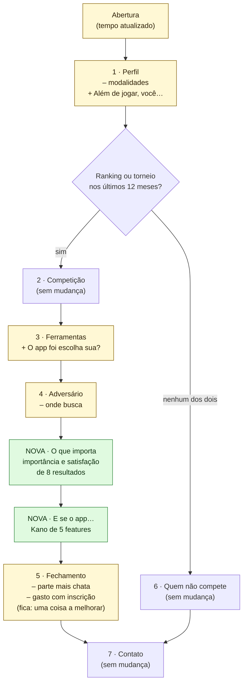

# 09 — Proposta de ajuste na pesquisa do Tally

Rascunho de ajustes no formulário **"Beach Tennis competitivo: como você joga e acompanha"** para medir **importância × satisfação** (pontuação de oportunidade) e **Kano**, e para identificar as proto-personas.

**Só a proposta.** O formulário não foi editado. Foi lido pelo conector do Tally em 25/09/2026: está em rascunho (não publicado), com 24 perguntas em 7 páginas (fora a abertura e o agradecimento) e 0 respostas.

Códigos de fonte no [`README.md`](README.md). Métodos explicados no [`08-plano-validacao.md`](08-plano-validacao.md).

> **Sem decisões de produto.** A escolha de quais resultados e features medir é uma proposta a partir do risco. Encurtar o formulário, e quando publicar, é decisão do Gabriel (perguntas 6 e 7 do `README.md`).

---

## O formulário hoje

| Página | Perguntas | Serve para |
| --- | --- | --- |
| 1 · Perfil | Tempo de jogo; frequência; categoria; modalidades; cidade; ranking ou torneio nos últimos 12 meses (com lógica para quem não compete) | Segmentar; identificar P1, P2, P3 |
| 2 · Competição | Rankings por semestre; torneios em 12 meses; mesma dupla?; como marca o jogo; quem registra o resultado; W.O. em 6 meses | `S2`, `S3`, `S11` |
| 3 · Ferramentas | O que usa; última vez que abriu o app; frequência de consulta da posição | `S1`, `S22` |
| 4 · Adversário | Procura informação?; o quê; onde | `S7` |
| 5 · Dores | Parte mais chata (até 2); gasto com inscrição; uma coisa a melhorar (aberta) | Visão geral |
| 6 · Quem não compete | O que afasta de rankings e torneios | P3 e não-público |
| 7 · Contato | Topa conversa de 20 min?; contato | Recrutar para as entrevistas |

**O que o formulário já faz bem:** pergunta sobre comportamento passado ("da última vez que você abriu…", "nos últimos 6 meses"), não sobre intenção. Isso segue a regra do [`08`](08-plano-validacao.md). E já recruta para entrevista, com o contato separado das respostas.

**O que falta para a síntese:** não mede **quanto** cada dor importa nem quão bem é atendida hoje (a pergunta "parte mais chata" dá ordem, não intensidade); não testa o tipo de Kano de nenhuma feature; não identifica quem não escolheu o app (P4) nem o professor-organizador (P5).

---

## A proposta em resumo

| Mudança | O quê | Por quê |
| --- | --- | --- |
| **+ 2 perguntas de perfil** | "O app foi escolha sua?" e "Além de jogar, você…" | Identificar P4 e P5; medir `S13` |
| **+ Bloco de importância × satisfação** | 8 resultados desejados do mapa do job, com duas notas de 1 a 5 cada | Pontuação de oportunidade (Ulwick) |
| **+ Bloco de Kano** | 5 features, com o par funcional/disfuncional | Testar a hipótese do [`07`](07-kano.md) |
| **− 4 perguntas** | Modalidades; parte mais chata; gasto com inscrição; onde busca informação do adversário | Compensar o tempo; as três primeiras ficam cobertas por outros blocos ou saem do foco de risco |
| **Texto de abertura** | "Leva uns 6 minutos" → "Leva uns 10 minutos" | Honestidade com o respondente; o tempo real sobe |

**Tempo estimado:** de ~6 para ~9 a 10 minutos. Uma matriz de 8 linhas leva ~1 minuto; os 10 itens de Kano, ~2 a 3 minutos.

---

## O fluxo proposto

**Legenda:** verde = página nova; amarelo = página com mudança. Os blocos novos vêm **depois** das perguntas de comportamento, para que a pessoa já tenha lembrado da própria rotina antes de dar nota.

---

## 1 · Duas perguntas de perfil

**Na página 1, depois de "Em qual categoria você joga hoje?":**

> **Além de jogar, você…** *(caixas de seleção)*
> - Dou aula de Beach Tennis
> - Organizo torneio ou ranking
> - Trabalho em arena ou clube
> - Nenhuma dessas

Identifica P5 (professor-organizador) e separa quem responde também como organizador. Hoje nada no formulário faz isso.

**Na página 3, depois de "Quais destes você usa…":**

> **O app que você usa para ranking ou torneio foi escolha sua?** *(múltipla escolha)*
> - Sim, eu escolhi
> - Não, a arena, a federação ou o circuito exige
> - Um pouco dos dois
> - Não uso app para isso

Mede `S13` (evidência contra, mas sem proporção) e identifica P4.

---

## 2 · Bloco de importância × satisfação

**Enunciado sugerido:**

> *Pense nos últimos meses em que você competiu. Para cada item, diga **quanto isso importa para você** e **como está hoje**.*

Duas matrizes com as mesmas linhas, na mesma página: a primeira com a importância, a segunda com a satisfação. Escala de 1 a 5, com rótulos só nas pontas.

- **Importância:** 1 = Não importa · 5 = Importa muito
- **Hoje:** 1 = Muito mal resolvido · 5 = Muito bem resolvido

"Muito bem resolvido" em vez de "muito satisfeito" evita marcar gênero na escala (pergunta D7 do feed, citada no `MER`).

**As 8 linhas propostas**, uma por etapa do job com dor forte ou por suposição de risco. A frase é a versão em linguagem do jogador do resultado desejado do [`04-mapa-do-job.md`](04-mapa-do-job.md):

| # | Linha no formulário | Resultado desejado | Suposição |
| --- | --- | --- | --- |
| 1 | Encontrar competições do meu nível perto de mim | J2.1 | `S14` |
| 2 | Saber o nível e o histórico de quem vou enfrentar | J3.3 | `S7` |
| 3 | Jogar contra quem está mesmo na minha categoria | J3.4 | `S20` |
| 4 | Ficar sabendo na hora quando meu jogo muda de horário | J4.2 | `S8` |
| 5 | Ver o resultado no ranking logo depois do jogo | J6.1 | `S3` |
| 6 | Ter uma solução quando o placar é contestado | J6.2 | `S4` |
| 7 | Entender por que minha posição mudou | J6.3 | `S6` |
| 8 | Ver minha evolução ao longo da temporada | J8.3 | `S24` |

**Reserva**, para trocar depois das entrevistas se alguma delas se mostrar mais importante: J1.1 (em que categoria posso jogar), J3.1 (inscrever a dupla e confirmar o pagamento dos dois), J4.3 (combinar data e quadra de um jogo de ranking), J6.4 (quanto falta para a linha de corte das Finals), J7.1 (resposta a um pedido de troca de parceiro).

**No celular:** matriz de 8 × 5 pode ficar apertada em 393px. A alternativa é uma escala linear por linha, em duas páginas (importância, depois satisfação). Custa mais toques, mas lê melhor. Vale testar no preview do Tally antes de publicar.

**Como analisar:** para cada linha, a porcentagem de notas 4 e 5 em importância e em satisfação, em escala de 0 a 10. Oportunidade = importância + máx(importância − satisfação, 0). Acima de 10 é **mal atendido**. Recortar por persona usando as perguntas de perfil (mapa no [`06-proto-personas.md`](06-proto-personas.md), em "Como reconhecer no Tally").

---

## 3 · Bloco de Kano

**Enunciado sugerido:**

> *Agora, imagine um app para o seu Beach Tennis. Para cada item, diga como você se sentiria **se o app tivesse** e **se o app não tivesse**.*

As cinco respostas, iguais em todas as perguntas:

> Eu gostaria · Já espero isso · Tanto faz · Dá para conviver · Eu não gostaria

**As 5 features propostas**, escolhidas onde a hipótese do [`07-kano.md`](07-kano.md) é mais frágil ou tem risco de Reversa:

| # | Pergunta funcional (se tivesse) | Pergunta disfuncional (se não tivesse) | Hipótese a testar |
| --- | --- | --- | --- |
| K1 | Se o app mostrasse **por que** sua posição no ranking mudou, como você se sentiria? | Se o app **não** mostrasse por que sua posição mudou, como você se sentiria? | Encantamento |
| K2 | Se o app mostrasse **quanto falta** para você entrar nas Finals, como você se sentiria? | Se o app **não** mostrasse quanto falta para as Finals… | Encantamento |
| K3 | Se o app mostrasse um **gráfico da sua evolução** na temporada… | Se o app **não** mostrasse sua evolução… | Encantamento |
| K4 | Se o resultado só entrasse no ranking depois que **o adversário confirmasse**… | Se o resultado entrasse **sem** o adversário confirmar… | Desempenho, com risco de Reversa |
| K5 | Se o app mostrasse os **resultados dos seus amigos** num feed… | Se o app **não** mostrasse os resultados dos seus amigos… | Indiferente (a hipótese mais frágil) |

**Como analisar:** cada par cai na tabela de avaliação de Kano (funcional × disfuncional), que dá o tipo por respondente. O tipo da feature é o mais frequente. Duas medidas ajudam a ler empates: o coeficiente de satisfação, `(A + O) / (A + O + M + I)`, e o de insatisfação, `(O + M) / (A + O + M + I)`, onde A = encantamento, O = desempenho, M = obrigatória e I = indiferente.

**Por que não mais features:** cada feature custa duas perguntas. Com 5, o bloco fica em ~2 a 3 minutos. As obrigatórias com confiança Média (horário, resultado a tempo, sessão) ficam de fora de propósito: a evidência já as sustenta, e perguntar sobre elas gasta tempo do respondente com pouca informação nova.

---

## 4 · As 4 perguntas que saem

| Pergunta | Por que sai | O que cobre no lugar |
| --- | --- | --- |
| "Quais modalidades você joga?" | Quase todo o BT competitivo é dupla; quem só joga simples já se identifica em "Nas competições de duplas, você joga com a mesma dupla?" ("Só jogo simples") | A pergunta de dupla |
| "Fora da quadra, qual é a parte mais chata de competir hoje? (até 2)" | Dá ordem, não intensidade; o bloco de importância × satisfação mede o mesmo com mais precisão | Bloco 2 |
| "Quanto você gasta por mês com inscrições?" | Valida `S18` (o jogador não paga pelo app), que já tem evidência Forte, e é sensível para responder | `NEG`, `PUB` 3 |
| "Onde você busca essas informações?" (sobre o adversário) | A pergunta anterior ("o que você procura") já mede `S7`; o "onde" aparece melhor na observação | Observação no torneio ([`08`](08-plano-validacao.md)) |

Se a decisão for **não encurtar**, os blocos 2 e 3 funcionam do mesmo jeito; o formulário só fica com ~11 minutos, e a taxa de abandono tende a subir.

---

## 5 · Detalhes de implementação no Tally

Anotações para quem for editar o formulário. Nenhuma foi aplicada.

- **Lógica condicional:** as páginas novas só aparecem para quem respondeu que jogou ranking ou torneio nos últimos 12 meses, como as páginas 2 a 5 hoje.
- **Obrigatoriedade:** deixar as matrizes e o Kano como opcionais evita abandono, mas cria respostas parciais. Uma saída intermediária: obrigatória só a matriz de importância.
- **Ordem das linhas:** se o Tally permitir embaralhar as linhas da matriz, embaralhar reduz o viés de ordem. As duas matrizes precisam ter **a mesma ordem** entre si.
- **Um pré-teste antes de publicar:** 3 a 5 pessoas respondendo em voz alta, no celular, para achar frase ambígua. Em especial as perguntas disfuncionais do Kano, que confundem na primeira leitura.

---

## Limites

- **As 8 linhas e as 5 features vêm da pesquisa de mesa.** Ulwick e Kano recomendam tirar os itens de entrevistas. Por isso a sequência do [`08`](08-plano-validacao.md) sugere entrevistar antes de publicar, e esta lista pode mudar depois das entrevistas.
- **Amostra.** Pontuação de oportunidade e Kano começam a ter leitura a partir de ~30 respostas por persona. Com menos, servem como indício.
- **Quem responde a um formulário de BT é quem já está engajado.** O canal de divulgação (grupos de ranking, Instagram de arena) define o público, e isso enviesa a favor de P1 e P2.
