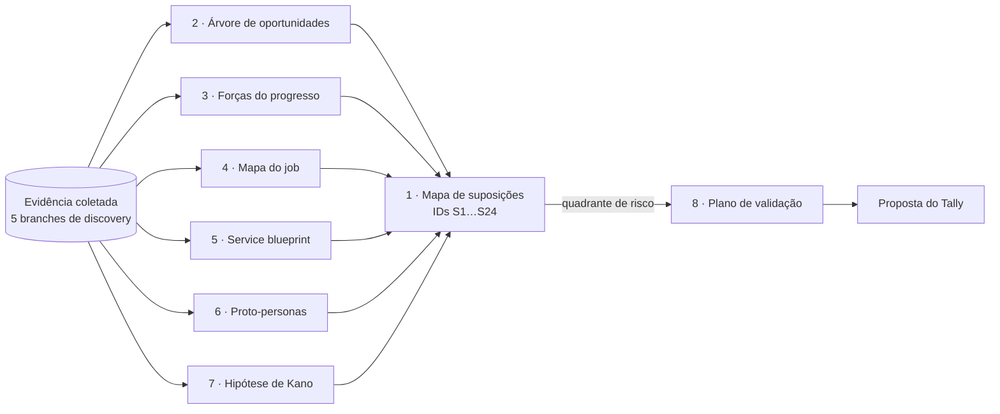

# Síntese do discovery com técnicas de UX — LetzPlay

A pesquisa de mesa do discovery (mercado, aprofundamento, organizadores, referências visuais) reorganizada em 8 artefatos clássicos de UX, mais uma proposta de ajuste na pesquisa do Tally. O objetivo é **organizar a evidência e preparar a validação com pessoas reais**, não decidir o produto.

Síntese feita em 25/09/2026, sem pesquisa nova: todo o insumo já estava coletado nas branches listadas abaixo.

> **Sem decisões de produto.** Nenhum artefato escolhe solução, escopo ou prioridade. Onde um artefato precisa de uma escolha para seguir (ex.: qual formato de ranking), ele mostra as alternativas e manda a pergunta para o fim deste arquivo.

---

## Por onde começar

| # | Arquivo | Técnica (autor) | Pergunta que responde |
| --- | --- | --- | --- |
| 1 | [`01-mapa-suposicoes.md`](01-mapa-suposicoes.md) | Assumption mapping (David Bland) | Em que o produto está apostando sem saber, e o que é mais arriscado? **Comece por aqui** |
| 2 | [`02-arvore-oportunidades.md`](02-arvore-oportunidades.md) | Opportunity Solution Tree (Teresa Torres) | Que resultado buscamos, que dores e desejos levam a ele, e que soluções o mercado já tentou? |
| 3 | [`03-forcas-progresso.md`](03-forcas-progresso.md) | Forças do progresso (Bob Moesta, JTBD) | O que empurra o jogador e o organizador para longe do WhatsApp, da planilha e do LetzPlay atual, e o que os segura? |
| 4 | [`04-mapa-do-job.md`](04-mapa-do-job.md) | Job map (Tony Ulwick) | Quais são as etapas de "competir em Beach Tennis" e onde dói em cada uma? |
| 5 | [`05-service-blueprint.md`](05-service-blueprint.md) | Service blueprint | Num fim de semana de torneio, o que o jogador vê, o que o organizador faz por trás, e onde quebra? |
| 6 | [`06-proto-personas.md`](06-proto-personas.md) | Proto-personas comportamentais | Que arquétipos de comportamento aparecem na evidência, e o que falta validar em cada um? |
| 7 | [`07-kano.md`](07-kano.md) | Modelo de Kano (Noriaki Kano) | Quais features da matriz de concorrentes são obrigatórias, de desempenho ou de encantamento? (hipótese) |
| 8 | [`08-plano-validacao.md`](08-plano-validacao.md) | Plano de validação | Para as suposições mais arriscadas, que método usar com pessoas reais e o que perguntar? |
| — | [`09-proposta-tally.md`](09-proposta-tally.md) | Pontuação de oportunidade + questionário Kano | Que ajustes na pesquisa do Tally medem importância × satisfação e Kano? (só a proposta) |

**Como os artefatos se conversam.** O mapa de suposições (1) é a espinha: cada suposição tem um ID (`S1`, `S2`…) que os outros artefatos citam. A árvore (2), as forças (3), o mapa do job (4) e o blueprint (5) são **lentes diferentes sobre a mesma evidência**, e cada um gera ou reforça suposições. As personas (6) e o Kano (7) são hipóteses sobre quem e sobre o quê. O plano de validação (8) e a proposta do Tally (9) fecham o ciclo: dizem como testar o que está no quadrante de risco.

---

## De onde vem a evidência

Os arquivos de origem estão em PRs abertos. Os links relativos destes artefatos apontam para onde os arquivos ficam **depois do merge** desses PRs; até lá, abra a branch indicada.

| Código | Arquivo de origem | Branch (PR) | O que traz |
| --- | --- | --- | --- |
| `DSC` | [`docs/DISCOVERY.md`](../../DISCOVERY.md) | `docs/prd-11-mapa-oportunidades` (#23) | Primeiro mapa de oportunidades; hipóteses H1–H6 e riscos R1–R3 |
| `MER` | [`SINTESE.md`](../SINTESE.md) | `docs/prd-13-discovery-mercado` (#26) | Top 10 oportunidades do jogador (O1–O10) e riscos RS1–RS6 |
| `MAT` | [`MATRIZ_FEATURES.md`](../MATRIZ_FEATURES.md) | idem | Matriz de features por JTBD, table stakes, lacunas L1–L12 |
| `VOZ` | [`VOZ_DO_USUARIO.md`](../VOZ_DO_USUARIO.md) | idem | Reviews de loja, Reclame Aqui e Reddit por JTBD |
| `PUB` | [`PUBLICO.md`](../PUBLICO.md) | idem | Perfil, gasto, atores; hipóteses de perfil HP1–HP10 |
| `CON` | [`CONCORRENTES.md`](../CONCORRENTES.md) | idem | Concorrentes do jogador e do organizador |
| `NEG` | [`NEGOCIO.md`](../NEGOCIO.md) | idem | Modelos de receita do segmento |
| `APR` | [`aprofundamento/README.md`](../aprofundamento/README.md) | `docs/prd-15-discovery-aprofundamento` (#28) | O que muda no top 10; correções à pesquisa anterior |
| `VZA` | [`aprofundamento/VOZ_AMPLIADA.md`](../aprofundamento/VOZ_AMPLIADA.md) | idem | Modo de falha da confirmação pelo adversário |
| `RAT` | [`aprofundamento/RATING.md`](../aprofundamento/RATING.md) | idem | Rating × ranking por pontos; regras CBT |
| `TDN` | [`aprofundamento/TEARDOWN.md`](../aprofundamento/TEARDOWN.md) | idem | Ranketes e LetzPlay v10 fluxo por fluxo |
| `RIN` | [`aprofundamento/REFERENCIAS_INTERNACIONAIS.md`](../aprofundamento/REFERENCIAS_INTERNACIONAIS.md) | idem | Como DUPR, Playtomic, Strava e UTR cresceram |
| `ORG` | [`organizadores/SINTESE.md`](../organizadores/SINTESE.md) | `docs/prd-16-dores-organizadores` (#30) | 5 dores fortes do organizador; riscos RO1–RO5 |
| `DOR` | [`organizadores/DORES.md`](../organizadores/DORES.md) | idem | Dores D1–D9 com evidência e gambiarras |
| `JOR` | [`organizadores/JORNADA.md`](../organizadores/JORNADA.md) | idem | Antes, durante e depois do torneio; ciclo do ranking de arena |
| `ARE` | [`organizadores/ARENA.md`](../organizadores/ARENA.md) | idem | O papel da competição no negócio da arena |
| `RTE` | [`organizadores/ROTEIRO_ENTREVISTA.md`](../organizadores/ROTEIRO_ENTREVISTA.md) | idem | Roteiro pronto de entrevista com organizador |
| `REF` | [`referencias/`](../referencias/README.md) | `docs/prd-14-referencias-visuais` (#27) | Padrões de UI por superfície (ranking, feed, navegação…) |
| `TLY` | Formulário do Tally "Beach Tennis competitivo: como você joga e acompanha" (`q46Jk8`) | — | Rascunho com 24 perguntas e 0 respostas em 25/09/2026. Lido, não editado |

Uma citação como `MER O3` quer dizer "oportunidade 3 do `SINTESE.md` de mercado"; `DOR D1` é a dor D1 do `DORES.md`; `DSC H2` é a hipótese H2 do `DISCOVERY.md`.

### Escala de força

A mesma de todo o discovery, para que os números conversem:

| Nível | Critério |
| --- | --- |
| **Forte** | Várias fontes independentes concordam, e pelo menos uma foi lida na íntegra ou é regra oficial |
| **Média** | Uma fonte específica e verificável, ou várias concordantes vistas só pelo resumo de busca |
| **Fraca** | Benchmark fora do BT, opinião, marketing de fornecedor ou inferência |
| **Nenhuma** | Só a premissa, sem fonte (usada no mapa de suposições) |

### Limites que valem para todos os artefatos

- **Não há entrevista com jogador nem com organizador.** A voz do BT brasileiro na amostra é pequena (o Reclame Aqui do LetzPlay tem 5 reclamações no total; o Reddit do BT fala de raquete). Toda persona, força e classificação de Kano aqui é hipótese.
- **Não há dado de uso do LetzPlay atual.** É a fonte que mais mudaria estes artefatos.
- **A voz de fora do BT pesa muito** (DUPR, UTR, Playtomic). Onde uma conclusão depende dela, o artefato marca.
- **A síntese não acrescenta fatos.** Onde um artefato diz algo que não está nas fontes, está marcado como *inferência*.

---

## Perguntas abertas

Só o Gabriel responde. Consolidadas dos 8 artefatos. As perguntas das pesquisas de origem continuam valendo e não se repetem aqui; estas são as que **a síntese** levantou ou deixou mais nítidas.

1. **Qual formato de competição a síntese deve tomar como principal: ranking de arena (desafio) ou torneio?** O mapa do job (4) e o blueprint (5) mostram que quem lança o resultado, quem avisa o horário e onde nasce a dor mudam por completo entre os dois. Refina a pergunta 1 do `DSC` e a 4 do `ORG`.
2. **Qual é o resultado desejado (outcome) da árvore de oportunidades?** A árvore (2) propõe três candidatos: R1 resultado confiável, R2 retorno do jogador, R3 tarefa do dia sem atrito. Torres pede **um** outcome por árvore; escolher é decisão de produto.
3. **A persona do organizador entra no escopo da pesquisa com pessoas reais, mesmo com a visão do organizador fora do MVP?** O blueprint (5) e as forças (3) mostram que a suposição mais arriscada do mapa (`S3`, alguém lança o resultado a tempo) depende do organizador, e duas das que a evidência já derrubou em parte (`S13` e `S22`) também. O roteiro de entrevista com organizador já existe (`RTE`).
4. **O professor-organizador é uma persona à parte?** Aparece na evidência de arena (`ARE`) e no vídeo de organizadoras (`JOR`), e a proto-persona P5 (6) o descreve. Nenhum JTBD do `CLAUDE.md` o cobre.
5. **Quais suposições entram na primeira rodada de validação?** O plano (8) ordena pelo risco, mas quantas entrevistas cabem antes do beta, e com quem, é escolha de tempo e acesso.
6. **O rascunho do Tally vai ao ar antes ou depois das entrevistas?** A proposta (9) funciona melhor depois de 5 a 8 entrevistas de troca, que dão a lista de resultados desejados (outcomes) a medir. Publicar antes ganha volume e perde precisão.
7. **Aceita encurtar o Tally para abrir espaço para a bateria de importância × satisfação e Kano?** A proposta (9) sugere tirar 4 perguntas e acrescentar 2 perguntas de perfil e 2 blocos (importância × satisfação e Kano). Ficaria em ~9 a 10 minutos, contra os ~6 anunciados.
8. **A hipótese de Kano deve considerar o jogador que não escolheu o app?** Quem usa o app porque a federação ou a arena exige (`MER RS4`) tende a tratar como "obrigatório" o que o jogador que escolheu trataria como "desempenho". Muda a leitura da tabela do Kano (7). A proposta (9) inclui a pergunta que permite separar os dois grupos na análise.

---

## Nota de método

- **Insumo:** 32 arquivos das 5 branches de discovery e o formulário do Tally, lidos na íntegra ou pelas seções de resumo e síntese de cada pasta.
- **Ferramentas:** nenhuma chamada ao Firecrawl (o material coletado bastou), nenhuma ao Mobbin. O Tally foi lido pelo conector (`load_form`), sem salvar nada.
- **Diagramas:** Mermaid, validados com o parser do `mermaid@11` antes de cada commit.
